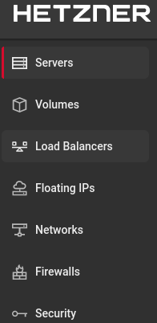
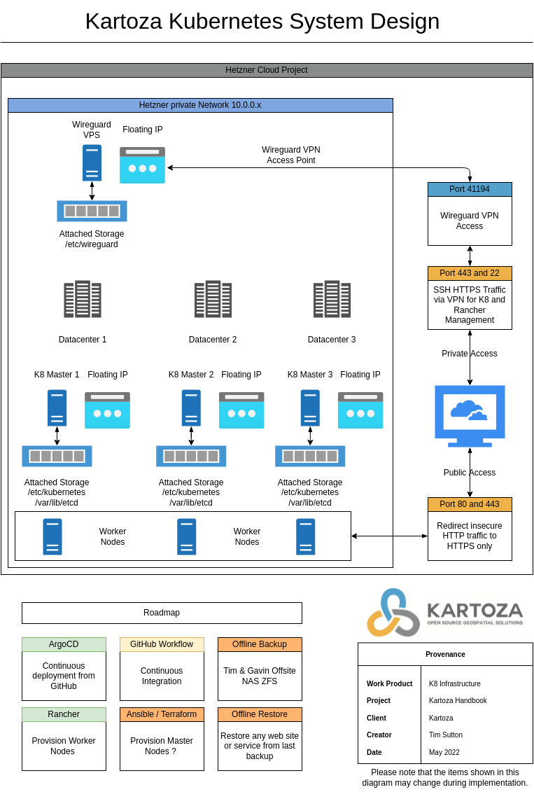

# Kubernetes Infrastructure

## Overiew

This section describes the infrastructure that is used to run the Kubernetes cluster. We do a from-scratch walkthrough of the infrastructure configuration and deployment up to the point of having Rancher running on the cluster with multiple masters.

### Some obectives

1. 🪛 Deploy Kubernetes on bare metal servers.
2. ⛑️ Secure all services behind hetzner firewall.
3. 💻 Distribute the master nodes across multiple servers and multiple datacenters for resilience.
4. 👮 SSH Access to all nodes via wireguard VPN only.
5. 📔 All configurations described here and versioned in Git
6. ✅ Maximise use of Hetzner cloud capabilities.

### Version history

Although this document is versioned in Git, major changes should be annotated here too.

1. 🕥️ Initial version - Tim Sutton May 2022

## Hetzner Project

The starting point for this deployment is a Hetzner project. I propose that we mirror this process for each new devops employee so that they understand the 'from the ground up' workflow of how the infrastructure is deployed in a sandbox environmnent.

> 📔 Hetzner software defined networks work only within a single project, so make sure all related services are in the same project.

We will make use of the following services within the project:

1. Servers: One goal is to reduce our environmental footprint. We will multi-tennant services across multiple servers to reduce the financial and environmental cost of running services. The master node servers will be deployed in different datacenters. Later in this document we will also seek to describe an architecture where the Rancher Longhorn cluster is replicated across multiple data centers.

2. Volumes: Any key persisten data should be mounted in Hetzner volumes. This will allow us to store the data in a highly available manner. We can detatch the volume, destroy and recreate the server and then reattach the volume. This applies equally to the etcd and other stateful data, and to the stateful data that is associated with the different kubernetes deployments.

3. Load Balances: As of writing, I am unclear if we have a use case for this as opposed to using the k8 load balancer capabilities. Potentially it could be used to balance traffic to our master nodes.

4. Floating IPs: We will use floating IPs to provide access to the Kubernetes cluster from outside the data center. The floating IP's will ensure that we can migrate the cluster to different hosts without having to change the IP address of the Kubernetes cluster.

5. Networks: We will create a private network for the Kubernetes cluster. This will ensure that no servers are publicly accessible. We will use a dedicated VPN host to provide access to the cluster via wireguard.

6. Firewalls: This will allow us keep all ssh and kubernetes management interfaces behind a VPN and only allow access to port 443 for running servers which are public facing. We will also expose the wireguard port for access into the VPN. Because of this we will run our rancher web admin console on a non standard part so that it is not publicly accessible.

7. Security: All staff should access the hosts via a single purpose SSH key. This will insulate the servers from possible compromise if your other keys (e.g. as used in GitHub) are compromised.

From these services we can already see our baseline design goals:

## TODO Items

1. Fully describe and verify online to offline to online backup and restore of all master nodes. See [this article].
2. Image scanning before deployment for better security.
3. Image slimming before deployment e.g. [slim.ai](https://www.slim.ai/).
3. [Terraform (is it needed?) with Hetzner](https://registry.terraform.io/providers/hetznercloud/hcloud/latest/docs)
4. Serivce accounts, roles and role bindings so that each developer can access their project namespaces and that they can have staging environments.
