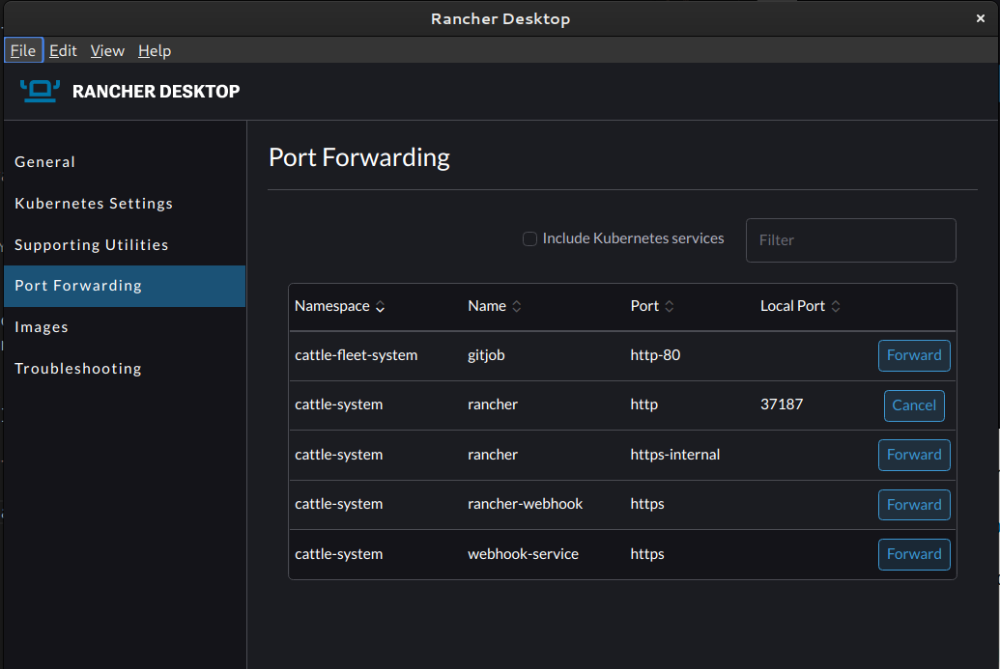

# Personal Kubernetes Infrastructure

## Initial Setup

This are initial notes from Tim on setting up a personal docker, rancher desktop and rancher server testbed environment.

I started by setting up rancher desktop on my Fedora based linux laptop. I used the appimage (despite a concerning looking warning that firefox gives about the image when downloading it.)

Here is the [installation guide](https://docs.rancherdesktop.io/getting-started/installation/#installing-via-appimage).

Once installed I performed the following commands to do a quick start setup of nginx running in the k8 cluster.

```bash
$kubectl get nodes
NAME                   STATUS   ROLES                  AGE   VERSION
lima-rancher-desktop   Ready    control-plane,master   80m   v1.22.7+k3s1

$kubectl create deployment nginx --image=nginx
deployment.apps/nginx created

$kubectl get pods
NAME                     READY   STATUS              RESTARTS   AGE
nginx-6799fc88d8-7k4kd   0/1     ContainerCreating   0          10s

$kubectl describe nginx-6799fc88d8-7k4kd
error: the server doesn't have a resource type "nginx-6799fc88d8-7k4kd"

$kubectl describe pod nginx-6799fc88d8-7k4kd
Name:         nginx-6799fc88d8-7k4kd
Namespace:    default
Priority:     0
Node:         lima-rancher-desktop/192.168.5.15
Start Time:   Sat, 23 Apr 2022 22:57:06 +0100
Labels:       app=nginx
              pod-template-hash=6799fc88d8
Annotations:  <none>
Status:       Running
IP:           10.42.0.9
IPs:
  IP:           10.42.0.9
Controlled By:  ReplicaSet/nginx-6799fc88d8
Containers:
  nginx:
    Container ID:   containerd://f85e833716a254f9e981ebf6c0f432edab366aacdfa74cc46b84904e6afc8760
    Image:          nginx
    Image ID:       docker.io/library/nginx@sha256:859ab6768a6f26a79bc42b231664111317d095a4f04e4b6fe79ce37b3d199097
    Port:           <none>
    Host Port:      <none>
    State:          Running
      Started:      Sat, 23 Apr 2022 22:57:23 +0100
    Ready:          True
    Restart Count:  0
    Environment:    <none>
    Mounts:
      /var/run/secrets/kubernetes.io/serviceaccount from kube-api-access-hl4hc (ro)
Conditions:
  Type              Status
  Initialized       True 
  Ready             True 
  ContainersReady   True 
  PodScheduled      True 
Volumes:
  kube-api-access-hl4hc:
    Type:                    Projected (a volume that contains injected data from multiple sources)
    TokenExpirationSeconds:  3607
    ConfigMapName:           kube-root-ca.crt
    ConfigMapOptional:       <nil>
    DownwardAPI:             true
QoS Class:                   BestEffort
Node-Selectors:              <none>
Tolerations:                 node.kubernetes.io/not-ready:NoExecute op=Exists for 300s
                             node.kubernetes.io/unreachable:NoExecute op=Exists for 300s
Events:
  Type    Reason     Age   From               Message
  ----    ------     ----  ----               -------
  Normal  Scheduled  33s   default-scheduler  Successfully assigned default/nginx-6799fc88d8-7k4kd to lima-rancher-desktop
  Normal  Pulling    33s   kubelet            Pulling image "nginx"
  Normal  Pulled     17s   kubelet            Successfully pulled image "nginx" in 16.398944871s
  Normal  Created    17s   kubelet            Created container nginx
  Normal  Started    16s   kubelet            Started container nginx

 timlinux  crest  ~  kubectl get pods
NAME                     READY   STATUS    RESTARTS   AGE
nginx-6799fc88d8-7k4kd   1/1     Running   0          44s

 timlinux  crest  ~  kubectl get pods -o wide
NAME                     READY   STATUS    RESTARTS   AGE   IP          NODE                   NOMINATED NODE   READINESS GATES
nginx-6799fc88d8-7k4kd   1/1     Running   0          57s   10.42.0.9   lima-rancher-desktop   <none>           <none>

$kubectl exec -it nginx-6799fc88d8-7k4kd /bin/sh
kubectl exec [POD] [COMMAND] is DEPRECATED and will be removed in a future version. Use kubectl exec [POD] -- [COMMAND] instead.
# curl 10.42.0.9
<!DOCTYPE html>
<html>
<head>
<title>Welcome to nginx!</title>
<style>
html { color-scheme: light dark; }
body { width: 35em; margin: 0 auto;
font-family: Tahoma, Verdana, Arial, sans-serif; }
</style>
</head>
<body>
<h1>Welcome to nginx!</h1>
<p>If you see this page, the nginx web server is successfully installed and
working. Further configuration is required.</p>

<p>For online documentation and support please refer to
<a href="http://nginx.org/">nginx.org</a>.<br/>
Commercial support is available at
<a href="http://nginx.com/">nginx.com</a>.</p>

<p><em>Thank you for using nginx.</em></p>
</body>
</html>
# exit

$kubectl get pods
NAME                     READY   STATUS    RESTARTS   AGE
nginx-6799fc88d8-7k4kd   1/1     Running   0          2m45s

```

These steps are verbatim from [this youtube video](https://www.youtube.com/watch?v=LwE8IA3glE4).

From this initial run through we can assume these basic concepts:


## Deploying Rancher on Rancher Desktop

I remember that Dominic explained about namespaces in his initial walk through so let me try to create a new  namespace.

```bash
$kubectl create namespace tim
```

While trying to figure out how to list my namespaces, I found [this nice k8 cheatsheet](https://kubernetes.io/docs/reference/kubectl/cheatsheet/).

The above cheatsheet didnt actually contain the tip I needed but a bit of googling came up with this:

```bash
kubectl get namespaces --show-labels
NAME              STATUS   AGE     LABELS
default           Active   141m    kubernetes.io/metadata.name=default
kube-system       Active   141m    kubernetes.io/metadata.name=kube-system
kube-public       Active   141m    kubernetes.io/metadata.name=kube-public
kube-node-lease   Active   141m    kubernetes.io/metadata.name=kube-node-lease
tim               Active   3m34s   kubernetes.io/metadata.name=tim
```

You can see my tim namespace listed as the last entry there. So based on doing that, I think I can update my concept diagram to look like this:


```kubectl
apiVersion: v1
kind: Pod
metadata:
  name: nginxpod
  namespace: tim
  labels:
    name: nginxpod
spec:
  containers:
  - name: web
    image: nginx
```

I saved the above as nginx.yml and was able to run it like this:

```bash
kubectl apply -f nginx.yml
```

Then I could check in the tim namespace to see if it was running:

```bash
kubectl get pods -A
NAMESPACE     NAME                                      READY   STATUS      RESTARTS   AGE
kube-system   local-path-provisioner-84bb864455-dsv47   1/1     Running     0          150m
kube-system   helm-install-traefik-crd--1-xrhvf         0/1     Completed   0          150m
kube-system   svclb-traefik-p9zwj                       2/2     Running     0          150m
kube-system   helm-install-traefik--1-m2r2x             0/1     Completed   1          150m
kube-system   coredns-96cc4f57d-5bzj8                   1/1     Running     0          150m
kube-system   traefik-56c4b88c4b-mpwfm                  1/1     Running     0          150m
kube-system   metrics-server-ff9dbcb6c-6gzt5            1/1     Running     0          150m
default       nginx-6799fc88d8-7k4kd                    1/1     Running     0          69m
tim           nginxpod                                  1/1     Running     0          14s

```

We can see my nginx pod in my namespace as the last entry.


# Installing Rancher on Rancher Desktop

I went [here](https://rancher.com/docs/rancher/v2.5/en/installation/install-rancher-on-k8s/) for instructions.


```bash
helm repo add rancher-latest https://releases.rancher.com/server-charts/latest
kubectl create namespace cattle-system
helm install rancher rancher-latest/rancher   --namespace cattle-system   --set hostname=crest   --set replicas=1 --set ingress.tls.source=secret
```

A little note here: the above tutorial provides different pathways to get a certificate. I am using ingress.tls.source=secret because I am just running on my local sytstem. In production you probably want to use a different option. Also I reduced replicas to 1 since I only have 1 pod in my local test environment.


After running, I got a nice message saying rancher is setting itself up:

```bash
NAME: rancher
LAST DEPLOYED: Sun Apr 24 11:25:45 2022
NAMESPACE: cattle-system
STATUS: deployed
REVISION: 1
TEST SUITE: None
NOTES:
Rancher Server has been installed.

NOTE: Rancher may take several minutes to fully initialize. Please standby while Certificates are being issued, Containers are started and the Ingress rule comes up.

Check out our docs at https://rancher.com/docs/

If you provided your own bootstrap password during installation, browse to https://crest to get started.

If this is the first time you installed Rancher, get started by running this command and clicking the URL it generates:

```
echo https://crest/dashboard/?setup=$(kubectl get secret --namespace cattle-system bootstrap-secret -o go-template='{{.data.bootstrapPassword|base64decode}}')
```

To get just the bootstrap password on its own, run:

```
kubectl get secret --namespace cattle-system bootstrap-secret -o go-template='{{.data.bootstrapPassword|base64decode}}{{ "\n" }}'
```


Happy Containering!
```

Let's use our experience from the simple nginx deployment to see what is running on the system now:

```bash
kubectl get pods -A
NAMESPACE                   NAME                                      READY   STATUS              RESTARTS      AGE
kube-system                 helm-install-traefik-crd--1-xrhvf         0/1     Completed           0             13h
kube-system                 helm-install-traefik--1-m2r2x             0/1     Completed           1             13h
kube-system                 svclb-traefik-p9zwj                       2/2     Running             2 (10m ago)   13h
kube-system                 local-path-provisioner-84bb864455-dsv47   1/1     Running             1 (10m ago)   13h
kube-system                 coredns-96cc4f57d-5bzj8                   1/1     Running             1 (10m ago)   13h
tim                         nginxpod                                  1/1     Running             1 (10m ago)   11h
default                     nginx-6799fc88d8-7k4kd                    1/1     Running             1 (10m ago)   12h
kube-system                 traefik-56c4b88c4b-mpwfm                  1/1     Running             1 (10m ago)   13h
kube-system                 metrics-server-ff9dbcb6c-6gzt5            1/1     Running             1 (10m ago)   13h
cattle-system               rancher-6448c4dcdf-8wpsk                  1/1     Running             0             3m37s
cattle-fleet-system         gitjob-cc9948fd7-jxgg5                    1/1     Running             0             44s
cattle-fleet-system         fleet-controller-5746685958-f4rx5         1/1     Running             0             44s
cattle-system               helm-operation-zfbfq                      0/2     Completed           0             68s
cattle-system               helm-operation-5sg9s                      0/2     Completed           0             16s
cattle-system               helm-operation-n6ggh                      2/2     Running             0             10s
cattle-fleet-local-system   fleet-agent-6c6c8c45f8-vtbnm              0/1     ContainerCreating   0             7s
cattle-system               rancher-webhook-6958cfcddf-z9rxr          0/1     ContainerCreating   0             5s

```

We can see various jobs are still spinning up in the cattle-system.

Next I went on a [little detour](https://www.linode.com/docs/guides/create-a-self-signed-tls-certificate/) on creating a self signed certificate that I can install in my rancher instance.

```bash
openssl req -new -newkey rsa:4096 -x509 -sha256 -days 365 -nodes -out tls.crt -keyout tls.key
```

> **Note:** I believe it is required to name the key tls.* so as to match the secret name.

Which outputs this:

```bash
Generating a RSA private key
...............................++++
......................................................................++++
writing new private key to 'tls.key'
-----
You are about to be asked to enter information that will be incorporated
into your certificate request.
What you are about to enter is what is called a Distinguished Name or a DN.
There are quite a few fields but you can leave some blank
For some fields there will be a default value,
If you enter '.', the field will be left blank.
-----
Country Name (2 letter code) [XX]:pt
State or Province Name (full name) []:
Locality Name (eg, city) [Default City]:
Organization Name (eg, company) [Default Company Ltd]:
Organizational Unit Name (eg, section) []:
Common Name (eg, your name or your server's hostname) []:
Email Address []:tim@kartoza.com
```

Then we have two certs in our directory:

```bash
$ls
tls.crt  tls.key  nginx.yml
```

Then on [this rancher page](https://rancher.com/docs/rancher/v2.5/en/installation/resources/tls-secrets/), I followed these notes to install my cert:

```bash
$kubectl -n cattle-system create secret tls tls-rancher-ingress \
  --cert=tls.crt \
  --key=tls.key
secret/tls-rancher-ingress created
```

Ok then back to the [main thread](https://rancher.com/docs/rancher/v2.5/en/installation/install-rancher-on-k8s/#6-verify-that-the-rancher-server-is-successfully-deployed) of the rancher installation tutorial I continued:

```bash
kubectl -n cattle-system rollout status deploy/rancher
```

Which returns this:

```bash
deployment "rancher" successfully rolled out
```

## Testing it out

The instructions say to open the host in your browser (in my case I used my local hostname of crest), but nothing opened.

I took a look in rancher desktop and played with the port forwarding. The default install looked like this:


So I went ahead and tried to forward that rancher port:



Then tried to open https://localhost:37443/

Which gave me an error:


The thing seems to be that you need to rather forward this port:


Then I was able ot open the site (different port number now) an set up my credentials following the hints provided.


> **Note**: Since I am using a self signed cert I had to do the normal firefox security warning process to proceed to the site.


I did however still have some errors now showing in rancher:


## Deploying a small application from a helm chart

I know helm charts are like the package managers of kubernetes, but I am not familiar with them, so I went to make a small test with the filebrowser.org (awesome app btw). I found these instructions and so ran and deployed it like this:

```bash
helm repo add utkuozdemir https://utkuozdemir.org/helm-charts
helm install my-release utkuozdemir/filebrowser
export POD_NAME=$(kubectl get pods kubernetes.io/name=filebrowser,app.ease" -o jsonpath="{.items[0].metadata.name}
export CONTAINER_PORT=$(kubectl get pod E -o jsonpath="{.spec.containers0].ports[0]. 
echo "Visit http://127.0.0.1:8080 to use 
kubectl --namespace default port-forward $POD_NAME 8080:$CONTAINER_PORT
```

From this I learned a couple of things:

1. We can pull helm charts from the internet with a system of repos
2. We can use xpath style queries to parse out bits of info from kubectl
3. The last line gives some hints about how to foward traffic out of k8