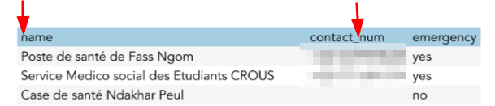
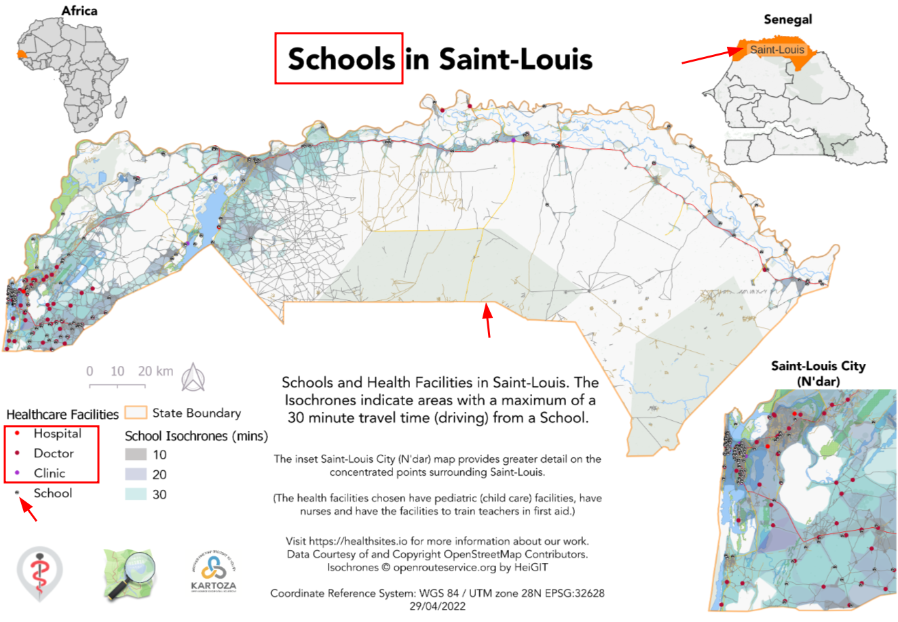

# Overarching Guidelines

In this section we present a series of guidelines that reflect the 'Kartoza Way' of doing things.

These guidelines are intended to be a set of best practices that are applicable to all projects. In many cases they refer to front end design, buy many equally apply to the way you assemble your project, design your architecture, or the way you build your code.

## Guideline 1: Inner workings

The user should not be exposed to the inner workings of the software / system.

With is guideline we try to avoid asking the user to perform activities that presume or require that they have inside knowledge of how the system works. Where breaking this guideline is unavoidable, such tasks should be well described so as to allow the user to carry out the task with the least possible friction.

In the example below, we can see the column headings for this table use
the naming convention of the internal database fields (lowercase, underscore separated) instead of humanised names (title case, space separated).

## Guideline 2: Use emphasis sparingly

If everything is emphasised, nothing is ephasised. They user's eyes won't be drawn to the emphasis. The emphisis should be placed on the story or message you are tyring to convey.

In this example, we can see our eyes are drawn to various elements on the map, but the key topic (schools) is lost amongst the other details.

## Guideline 3: Don't present data, present insights

Our systems are generally designed to collect and manage data, but users need to use this data to gain insights that help them to make decisions or understand the world better.

## Guideline 4: Attribution

If you use somebody else's work, you should give credit. This applies equally to code, design, and documentation. If you add a snippet from stack overflow, include a comment above referencing the original post.

If you include data on a map, make sure the map includes a note crediting the data source, or an addendum that states what license the data is licensed under e.g. Creative Commons](<https://creativecommons.org/licenses/by/4.0/>) license.

## Guideline 5: Layout

Layout visual elements in a consistent way in terms of size, colour and spacing. Break this rule with intention. Modern CSS frameworks provide grids. In QGIS and other design apps, you can create a grid and snap your elements to it. When you decide to break the grid layout, do so as an explicit decision rather than as a side effect of not paying attention to detail.
