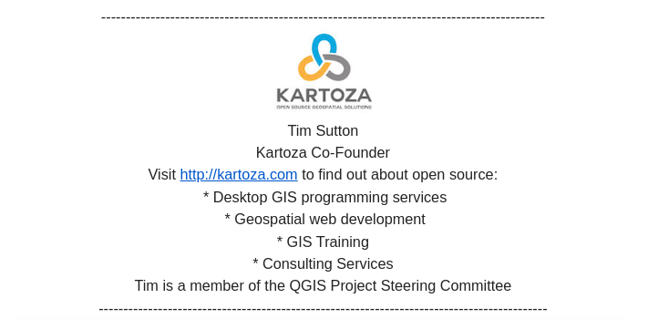

# Communication

In Kartoza, communcation is probably the most important skill that we want to engender in our staff. Whether it is communicating your work in standups and issues, talking with clients, checking in with project leads, writing emails and reports, communication is probably the most important skill needed for your work.

Good communication keeps the company running smoothly, keeps happiness levels high, instills a sense of professionalism in customers and the outside world that interact with us, and prevents wasting time and effort.

As a purely virtual company, communication skills are particularly important because we do not work together in a physical space and we need to make extra effort to ensure that we communicate well.

## Communication Systems

### Slack

Slack is our primary communication mechanism. You should have slack running and available at all times during your work day. If you run mission critical systems (e.g. maintaining client web sites, server infrastructure), you should have slack on your phone so that we can contact you after hours in emergencies.

In some cases our clients have slack channels, which you should participate and monitor as needed to carry out your client related tasks.

All staff members are at minumum members of the '1-kartoza'  and '4-random' channels. You should use 1-kartoza for **all your general communications**.

You might be tempted to use DMs (Direct Messages) to ask team mates for technical information, plan work etc. **Please don't do this!** Use the 1-kartoza channel for all communications unless it is something of a personal nature that you need to discuss with management.

Why do we ask you not to use DMs? Because when you communicate in the 1-kartoza channel that is public to the company, we realise a number of benefits:

1. We can see what things you are working on.
2. We can see you are actively working (which is often difficult in a virtual company).
3. If you are experience a technical issue, the whole company can be aware of it and potentially help you, rather than you being stuck waiting for a single person to help you.
4. If you are stuck on something, project leads and management can be aware of which projects are having issues and plan accordingly.
5. It creates a sense of 'togetherness' that is otherwise lost in a virtual company.

For internal company communications, we have our lowest bar in Slack in terms of how much attention you need to pay to grammar and crafting beautiful prose.

### Email

All Kartoza employees are issued with an email address ending in @kartoza.com. When you set up your email account, make sure to include our corporate branding in your signature as per the image below.

Here is the signature in text form:

​

Tim Sutton
Kartoza Co-Founder

Visit <http://kartoza.com> to find out about open source:

* Desktop GIS programming services
* Geospatial web development
* GIS Training
* Consulting Services

Tim is a member of the QGIS Project Steering Committee

----------------------------------------------------------

Replace the line under your name with your job description e.g. Senior Developer.

When writing emails there are a few things we want you to ensure which we list below:

* **Correctness:** Check the details in your email are factually correct.
* **Completeness:** Make sure you address all the questions raised if it is a reply to a colleague or client.
* **Professionalism:** Make sure that you have spell-checked your email (use grammarly or similar if needed and especially if you are not a native english speaker).
* **Responsiveness:** Reply to emails within a working day, even if the reply is just to confirm receipt and inform the other person when they will get a complete reply.
* **Politeness:** Emails should be written in a polite way - never be rude to the person you are communicating with even if they are being rude to you. Politeness includes taking the trouble to spell names correctly, thank the person for their email and greet them at the start and end of your mail.

### Meet / Video Call

Often you will need to meet with clients on Google Meet or similar video conferencing call.

When attending a video / voice call, follow these guidelines:

* **Be on time:** Join the call a few minutes before it starts so that you are 'ready to go' when the call kicks off.
* **Check your environment:** Most of us work from home and that means sometimes we might have pets or family or other things going on. Try to sit in a place where you can work without distracting the call participants of these thngs. Make sure the room (or at least the part of the room visible in the camera frame) is tidy and neat.
* **Sound:** It is critical you can be heard during the call. Ensure you have a good microphone and camera and that your environment is noise free - it will be a distraction for the other call participants.
* **Bandwidth:** As a virtual / remote worker, you are responsible for ensuring that you have a reliable internet connection that is fast enough to handle voice calls with video / screenshares. This is a condition of your employment and if you do not have an adequate connection, we may not be able to keep you under our employment.
* **Power:** If you live in a power challenged society (e.g. South Africa), you are expected to ensure you have alternatives in place to ensure you have power during meetings - charged laptop batteries, battery packs for your internet connection etc.
* **Avoid being overly familiar:** Be friendly and open but keep in mind we are typically billing clients for our time during a call, or they are assessing the possibility of contracting us or collaborating with us. For this reason keep the focus of the call on work.
  
## Escalation

When you are communicating with colleagues, especially if it is something urgent you should follow this escalation procedure if you do not get the response you need:

* Ask them in the original medium (email / slack / video call)
* Follow up with a second medium (e.g. a nudge in slack to check email) if you do not get a timely response
* Send a calendar invitation for a short meeting if you get no response.
* Send the person a whatsapp / telegram etc.
* Phone the person (mobile/whatsapp/telegram etc.)
* Ask their line manager or a colleague to reach out to them

Continue escalating the frequency and form of communication until you get a response.
