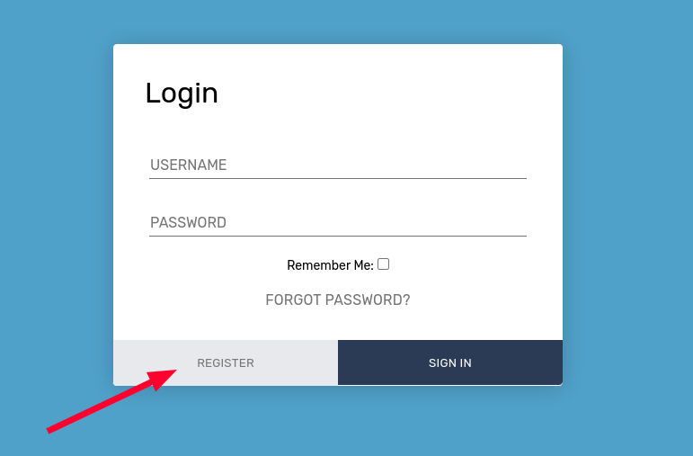
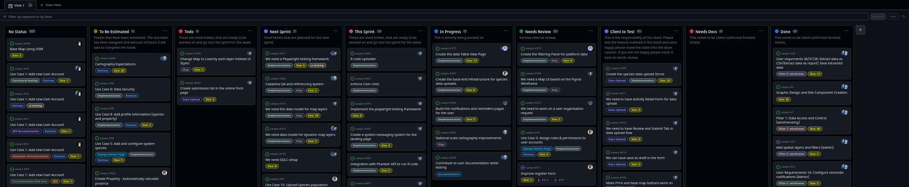

# Your daily workflow at Kartoza

## Starting your day

The activities for your day are determined by:

1. Which project you are working on, as listed in the company-wide project Gantt chart / sheet. Normally we try to have you work on a single project per day to reduce cognitive friction as you context switch from one project to another.
2. The scrum board / project board for that day's project. The list of sized tickets should be implemented sequentially, from the top of the 'This sprint' (or Ready or 'To-do') column, down to the bottom.

## Story points

Your issues closed in GitHub (GH) in a day should equate to a day's worth or more (assuming some tasks will be quicker than estimated) of GH issue sizes. Before working on any issue it should be sized. Any issue deemed to be larger than one day of work (size 8) should be split into smaller issues.

## Standups

Your daily stand ups should be written like this:

--------

### Yesterday

**Project: Flux Capacitor Enlargement**

* [Size 4] Closed <https://github.com/fcap/foobar/issues/123> - Add transparency to map
* [Size 4] Closed <https://github.com/fcap/foobar/issues/124> - Add transparency to legend
* [Size 2] WIP <https://github.com/fcap/foobar/issues/125> - Add transparency to widgets

**Project: Kartoza**

* [Size 1] Water cooler - outed @Rudolf as a serial imposter

### Today

**Project: Flux Capacitor Enlargement**

* [Size 8] <https://github.com/fcap/foobar/issues/128> - Render flux capacitor on map

### Blockers

* Waiting for client to respond with clarification request on <https://github.com/fcap/foobar/issues/130>

--------

Here is an example from our Slack of a beautifully presented standup - yours should look like this too!

## Running your timesheets

We run our own timesheet application (thanks Dimas!) at [timesheets.kartoza.com](https://timesheets.kartoza.com/) - and in our ERP Next platform. The timesheets.kartoza.com is preferred since it has many niceties to make your time tracking more efficient. We bill our customers in 15-minute increments, rounded down or up as appropriate. This is aggregated across the day. That means if you e.g. log 2h12 minutes on one cost center for a client and 1h00 minutes on another cost center for the same client, the client will be billed 3h15min for the day's work.

The descriptions in your timesheets should be defensible, terse descriptions of work with links to GitHub issues. Defensible means that if a client were ever to ask you to justify how you spent your time in an invoiced line item, we can refer back to the description and see references to tickets worked on and the story points associated with the work.

**Your timesheets should match the projects planned on the planner sheet.**

## Setting up the timesheet account

Step 1: Go to <https://timesheets.kartoza.com>

Step 2: Choose register to create your account:

Step 3: Complete the form to create your account:

Step 4: Use the cog menu to get to the settings panel

Go to ERP Next to get your API keys by looking in your user profile e.g.

<https://kartoza.erpnext.com/app/user/YOURUSERNAME%40kartoza.com>

Back on the timesheets app, in the form that appeared from the cog menu, enter your API key and secret:

Now use button (1) to pull data from erpnext then button (2) to return to your timesheet.

## Completing your timesheet

Once you are logged in, you will see this interface:

The **Activity** dropdown has a list of activities, such as meetings, applied GIS work, coding, etc. This is a mandatory field and an option needs to be selected there to describe the type of activity being recorded. 

The **Project** dropdown has a list of ongoing projects at Kartoza. If the activity being recorded is related to Kartoza, such as Admin tasks, or internal meetings such as All Hands meetings then this can be left blank and the system will automatically record it as Kartoza. However, if the task is related to a project, select a project from the dropdown.

The **Task** dropdown has a list of tasks pertaining to specific projects, this differs from project to project since the tasks will be broken down by high-level requirements so if the project requires development there would be a dropdown value 'Development/Implementation' but other projects might not need implementation. If you can't find the specific task you are doing, either look for the list and see what fits it (for example if the task you are recording is to discuss the data model with the client then you can select 'Modelling' from the list instead). However, if a task is crucial and missing from the list, contact Marina.

## View the Planning sheet
The planning sheet shows the schedule for the list of Kartoza members and the projects they are assigned to. This can  be accessed by clicking on the cog menu and selecting 'Planning':

Using this, you can see what projects are assigned to you for a specific period. Since projects will include various staff members, you can also find out who else is simultaneously assigned to the project in case you have queries or need to work on a task with someone and need their help.

## View the Burndown chart
The burndown chart provides information on how much time we have left to complete the project, how much time was allocated to a specific project and how much we have exceeded the allocated time if the project is not concluded on the specified deadline. This can  be accessed by clicking on the cog menu and selecting 'Burndown Chart'.

## Additional Guidelines

Developing a project can be a lot of fun and enjoyable to work together to make
something awesome, but we need to do it within the guide rails which we have
laid down:

1. Work only on the project allocated to you in your planning sheet. If you
   need to work on something else, you need to communicate with your project manager and ask
   her to change your planning allocation. Do this ahead of time, not on the day
   of working.
2. You need to follow the scrum board - if the ticket you have chosen in your
   standup is not on the scrum board, that is a complete No-No.
3. You need to work only on tickets you have been assigned - if someone asked
   you to work on #46, you need to ask them to allocate you as the
   developer.
4. Before working on any ticket, it needs to be sized. You listed [5] as the
   effort for your ticket in the standup, but your ticket lists [1] as its
   size. If you disagree on the sizing you cannot start to work on the ticket
   before reaching consensus with the technical lead.
5. You need to work only on tickets that are in the 'this sprint' (or Ready or 'To-do') column - you
   currently have only one ticket #57  which is eligible to be worked on. If
   you feel another ticket needs to happen first (e.g. it is a logical dependency)
   then again, you need to have a conversation with the technical lead and ask
   them to update the board to accommodate your requested changes to the plan.
6. When you write that you will work on a ticket of 8 points or less, it needs
   to be done at the end of your workday with a neat PR referencing the
   ticket, providing testing (both backend and UI), providing a screen grab or
   better, an animated GIF illustrating the work done, passing all coding
   standard checks (pylint / black /pep8 etc.). If at the end of the day you have
   not finished what you committed to then you have taken a wrong turn in your
   workflow - you probably would have realised that you would not finish the task
   at 50% in and you should have raised the issue with your team along with an
   estimate of how much time extra will be needed to resolve. Then you stop
   working on that ticket and work down the sprint board onto the next issue.
7. Basically when you go over your estimate, you are spending either the
   client's money or Kartoza's profits for the job, neither of which should
   be done without conscious agreement of your team mates.

We really need you to step up and introduce this rigour into your work.  As you
can see in the list above, in no case do we ask you to do anything unreasonable
- we don't ask that you 'grind out' 18 hour days coding and going quietly
insane with stress and pressure - we just want to see work delivered in a
steady, orderly flow so we can predict timelines, make profit, please our
clients and be awesome! So please keep it tight and communicate with your project
manager and technical team lead using the framework above, let us see a PR at
the end of the day (or more if your queue has multiple issues), and take on the
tasks in a respectful, communicative, methodical and conscious manner.  We
promise if you do that, your enjoyment of your work is going to sky rocket and
your rapport and respect of your colleagues will too!

## Creating issues and linking them to projects
1. Create an issue on the Issues page and populate it properly (referenced elsewhere)
1. Link the Issue to the project. This puts it in the _funnel_ for _triage_
1. Link it to a milestone. 
1. Tag it if you like.
1. Do NOT assign it to anyone

## Team lead / Senior dev sprint planning roles
1. Review and curate the kanban board well before a sprint planning meeting
   1. Check that issues are moving along the board. A cluttered board is a sign of poor progress or poor management or both!
   1. Sprint planning meeting should be short and focus on allocating work for the next sprint
1. Set up and manage milestones in GitHub. These should match ERPNext tasks.
1. Based on the project plan and other inputs decide wich issues should join the backlog. Add them from the Triage list to the backlog and order them, then direct them to be sized.
1. In the sprint planning meeting, based on discussion and sizes, move issues into the Ready column and assign them. 
1. The Ready column must have only as many issues as the team can do in one sprint, no more!

## The scrum board

Our scrum boards are organised like this project below: 

The columns of the scrum board have the following purposes:

⛔️**No Status (aka Backlog):** There are all issues that have been raised by
anyone. There is currently no plan to work on these, but they are topically
connected to the project board.

* 🕵️Who can place tickets in this column?:
* 👨Any stakeholder!

⏳️ **To be estimated:** Tickets that have to be estimated for an upcoming
sprint. The size label has to be assigned based on the amount of hours it will
take to complete the ticket.

The following sizing scheme should be used:
 - 1️⃣  It's quick I will have this done in 1 hour
 - 2️⃣ Give me 2 hours and I will have it for you
 - 3️⃣ It will take me between 2 hours to half a day
 - 5️⃣ It will take between half a day and a full day
 - 8️⃣ This is a full day job
 - 1️⃣3️⃣ I'm going to need about a day and a half to do the job
 - 2️⃣0️⃣ It will take at least two to three days
 - 4️⃣0️⃣ This will take a full week

For any ticket that has been assigned a value larger than 8, the ticket must
be broken out into smaller issues so that the units of work are 1 day or
less.

- 🕵️Who can place tickets in this column?:
- 🏉 Only the project planner ('scrum master') in collaboration with the client where appropriate.

🛒**TODO:** These are sized tickets, that are ready to be worked on and go into
the sprint for the week. The should be listed from top to bottom in priority
order. During the sprint planning call, items for the upcoming sprint are
identified from this column (see below).

- 🕵️Who can place tickets in this column?:
- 🏉 Only the project planner ('scrum master') in collaboration with the client where appropriate.

🏃**Next Sprint:** These are tickets that will be worked on in the **next**
sprint. They are placed here during the sprint planning call (which happens the
week before a sprint starts) so that they do not cause confusion with the items
in the current sprint plan. Only sized tickets should be in this column. The
cumulative total of the sizes of issues in the next sprint column should be a
little more than the number of hours that have been allocated to the team
members. This is because sizing should be conservative and if the team finish
their tasks more quickly than expected, they should have enough other tasks to
keep busy.

- 🕵️Who can place tickets in this column?:
- 🏉 Only the project planner ('scrum master') in collaboration with the client where appropriate.

🏃**This Sprint:** These are tickets that will be worked on in the **this**
sprint. They are placed here at the start of the sprint in the order
(vertically) in which they should be completed, highest priority at the top.
Only sized tickets should be in this column. As per above, the cumulative total
of the sizes of issues in the sprint column should be a little more than the
number of hours that have been allocated to the team members.
- 🕵️Who can place tickets in this column?:
- 🏉 Only the project planner ('scrum master') in collaboration with the client where appropriate.

👩**In Progress:** When the team members are ready for a new task, they move
the task they will work on from the 'This Sprint' Column to the 'In Progress'
column to indicate they are working on that issue. In most cases, there should
only be one issue per team member in the 'In Progress' column at any time.

- 🕵️Who can place tickets in this column?:
- 👩Only the developer / team member working on the ticket.

👨**Needs Review:** When a team member completes their work on an issue, they
place it in the needs review column. At this point our testing team members
will go and verify they feature works as expected.
- Situations in which a ticket may fail review:
- Functionality does not match requirements in ticket.
- Changes result in a regression elsewhere.
- Changes result in errors to be logged in javascript console.
- Changes result in errors to be logged in sentry.
- Changes result in errors to be logged in console.
- If a ticket fails review, it should be moved back to the 'This Sprint' column.

- 🕵️Who can place tickets in this column?:
- 👩Only the developer / team member working on the ticket.

🏋️**Client to Test:** Whenever a feature has been completed and tested
internally, it should be signed off by the client. Placing the issue in this
column indicates to the client that this item is ready for testing. In some
cases, changes may not be client facing and the project planner may choose to
skip this step.

- Situations in which a ticket may fail review:
- Functionality does not match requirements in ticket.
- Customer raises an issue with the functionality not working as expected.
- Customer encounters a bug or error using the new functionality.

- 🕵️Who can place tickets in this column?:
- 👩The developer / team member working on the ticket.
- 👨The tester who just completed working on the ticket.
- 🏉The project planner / scrum master

✍️**Needs Docs:** Documentation should be a standard part of the sizing of
tickets. This should include code documentation ('docstrings'), API docs, user
manual entries etc. If, however, the ticket results in changes to workflows
(e.g. screenshots need updating, workflows change)

- 🕵️Who can place tickets in this column?:
- 🏉The project planner / scrum master

🌄 **Done:** Everyone is happy! Yay! The ticket can be marked as done.

- 🕵️Who can place tickets in this column?:
- 👩The customer.
- 🏉The project planner / scrum master

