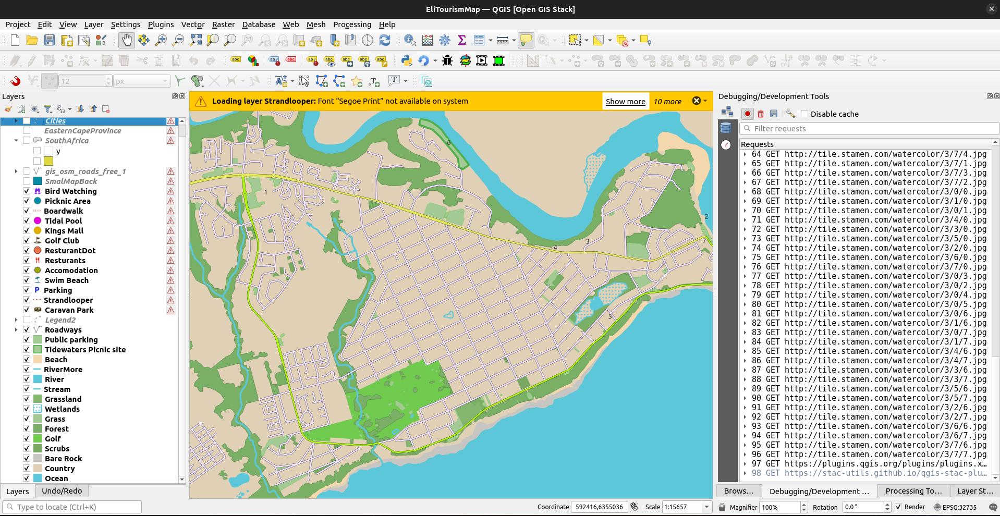

# Essential Software

In this section we will enumerate all of the software packages you should have installed on your computer. There are some items that can be considered optional, but you should be aware of all of these tools and install them when and as the need arises.

## QGIS

URL: 
Purpose:
Notes:

## Postgresql

URL: [www.postgresql.org](https://www.postgresql.org/)
Purpose: Relational database management system with GIS support.
Notes:

## LibreOffice

URL: [libreoffice.org/](https://libreoffice.org/)
Purpose: Office productivity suite.
Notes:

## Git & GitHub Account

URL: [github.org](https://github.org)
Purpose: Version control of digital assets
Notes: Although GitHub is not Git, you need to be set up to work on github.

##

URL: 
Purpose:
Notes:

##

URL: 
Purpose:
Notes:

##

URL: 
Purpose:
Notes:

##

URL: 
Purpose:
Notes:

##

URL: 
Purpose:
Notes:

##

URL: 
Purpose:
Notes:

##

URL: 
Purpose:
Notes:

##

URL: 
Purpose:
Notes:

##

URL: 
Purpose:
Notes:

##

URL: 
Purpose:
Notes:

##

URL: 
Purpose:
Notes:

##

URL: 
Purpose:
Notes:

##

URL: 
Purpose:
Notes:

##

URL: 
Purpose:
Notes:

##

URL: 
Purpose:
Notes:

##

URL: 
Purpose:
Notes:

##

URL: 
Purpose:
Notes:
