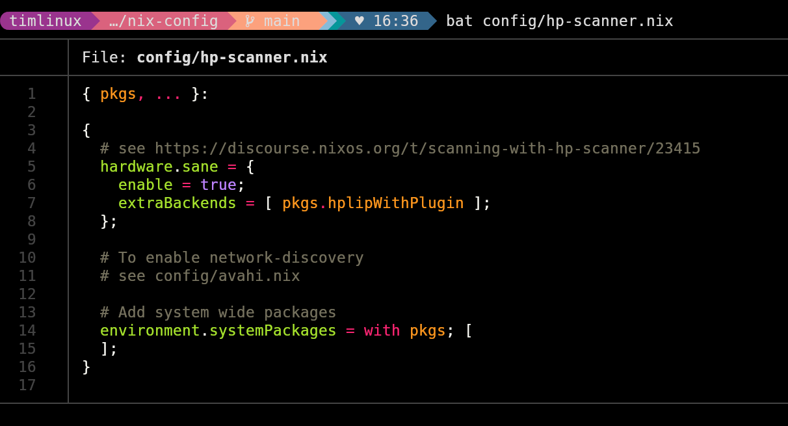
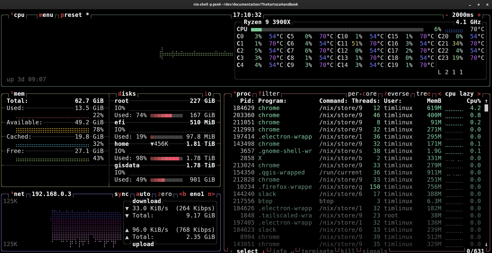

# Essential Software

In this section we will enumerate all of the software packages you should have installed on your computer. There are some items that can be considered optional, but you should be aware of all of these tools and install them when and as the need arises.

In addition to essential software, there are many useful packages that you should be aware of that can be occassionally used to improve your productivity. Tim maintains a list of these declaratively in his [Nix Config Repo](https://github.com/timlinux/nix-config).

## Graphical Applications

### QGIS

URL: 
Purpose:
Notes:

###

URL: [https://flameshot.org/](https://flameshot.org/)
Purpose: Taking annotated screenshots efficiently
Notes: I map Ctrl-4 to the tool in gnome like this:

### LibreOffice

URL: [libreoffice.org/](https://libreoffice.org/)
Purpose: Office productivity suite.
Notes:

## Services

### Postgresql

URL: [www.postgresql.org](https://www.postgresql.org/)
Purpose: Relational database management system with GIS support.
Notes:

## Console applications

These are applications used from the command line.

### Asciinema 🎞️

URL: [https://asciinema.org/](https://asciinema.org/)
Purpose: Terminal session screen recorder
Notes:

Nixos packages:
* asciinema
* asciinema-agg
* asciinema-scenario

### bat 🔧 

bat is a modern alternative to 'cat'. It lists the contents of a file on stdout.

Nixos packages: bat

### btop

btop : A modern alternative to top - list the running processes on your system |🔧 

Nixos packages: btop

### byobu

byobu | Terminal multiplexer |🔧 
comma # handy "nix-shell -p" shortcut - just do ", programmename" and it does rather "nix-shell -p programmename"
cowsay | Useful tool to say stuff with the persona of a cow |🔧 
exa |Modern alternative to ls - lists files |🔧 
fd | Modern alternative to find - finds files |🔧 
ffmpeg_5-full | Free MPEG encoder |🎞️
figlet | Make ASCII text titles |🔧 
git | Version control management tools |🔧 
gotop | go based top - list the running processes on your system |🩺
iftop | list the network traffic on a network interface|🩺
imagemagickBig | command line based image manipulation  |✏️
lazydocker | helpful docker command line docker ui |🔧 
lazygit | helful git command line ui|🔧 
mc | console based file manager |📁
ncdu | disk usage reporting too | 🖴
neofetch | show useful system info (I have it show whenever I open a terminal) |🔧 
nethogs | show which processes are consuming bandwidth on your machine |🔧 
nix-direnv | Automatically set up your dev env when you enter a directory. |🔧 
pgcli | More modern postgres terminal client |🔧 
wget | Fetch files from the internet in your console |🔧 
dua | better du command |🔧
exa | better ls command |🔧
fish | fish shell like bash but with lots of goodies |🔧
gping | a better ping implementation |🔧
kitty | nicer terminal emulator with a lot of cool features |🔧
lftp | for remote backups |🔧
ranger | console file manager |📁
powertop | swee what apps use the most power on your machine |🔧
restic | for local backups |🔧
unzip | unzip stuff |🔧
usbutils | lsusb etc |🔧

### Git & GitHub Account

URL: [github.org](https://github.org)
Purpose: Version control of digital assets
Notes: Although GitHub is not Git, you need to be set up to work on github.

## Auxilliary applications:

### Gui apps

Name | Description | Type
-----|-------------|-----
audacity | Sound file editor |🎤 
blender | 3D Graphical Scene Modelling | 📦️
dbeaver | Database IDE and diagram generator | 🛢️ 
deja-dup | Backup Application | 🖴
emote | Emoji picker (invoke with ctrl-alt-e) | 😀
drawio | Diagraming tool | ✏️
flameshot | Screenshot tool  | 🖥️
gimp | Raster painting / image creation tool | ✏️
gnome.gnome-sound-recorder | Simple voice / recorder | 🎤
gnome.gnome-terminal | Terminal application for command line work | 
firefox | Web Browser | 🌐
google-chrome | Google's ubiquitous web browser |🌐
gpick | Colour picker |✏️
inkscape | Vector art / graphics application |✏️
kdenlive | Timeline based video editor |🎞️
keepassxc | Offline password vault |🔑
nextcloud-client | Sync client for NextCloud |🌐
obs-studio | Screencasting application |🎞️
paperwork | Document manager |🗎
qtcreator | C++ IDE for Qt5/6 |🔧 
slack | Chat tool for company communications |💬
synfigstudio | 2D animation studio |✏️
tdesktop | Telegram chat client |💬
vscode | Multi-language IDE |🔧 
xournalpp | PDF annotation / editing tool |✏️
citations | Citation manager |🗎
emblem | Modern emjoi browser (alternative to emote) - needs Gnome 44 |😀
eyedropper | Colour picker (alternative to gpick) - needs Gnome 44 |✏️
gaphor | |
lorem | Lorem ipsum text generato - needs Gnome 44 |🗎
solanum |  - needs Gnome 44|
zap | Sound effects board  - needs Gnome 44|🎤

