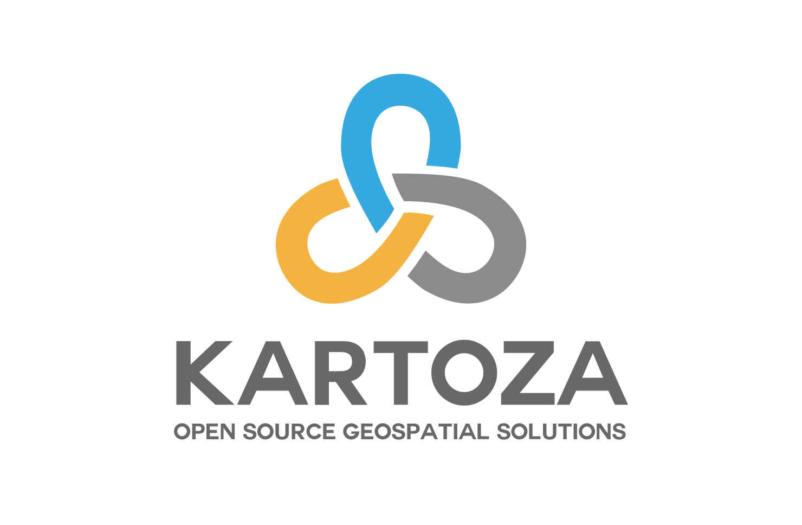

# About Kartoza

In this section we describe the company, our ethos and general expectations of
our team members and their use of technology and systems within the company.

All staff members are expected to read and comply with (where applicable) the
content laid out in this handbook.

Kartoza is a South Africa-based Free and Open Source GIS (FOSSGIS) service provider. We use GIS software to solve complex location-related problems for individuals, businesses and governments around the world.

Kartoza was formed as a merger between Linfiniti and Afrispatial.

Learn more at our company website [https://kartoza.com](https://kartoza.com)

* [Strategic Objective](./strategic_objective.md)

Working at Kartoza:

* [Your Kartoza Computer](./setting_up_your_computer.md)
* [Essential Software](./essential_software.md)
* [Daily Workflow](./daily_workflow.md)
* [Communication](./communication.md)
