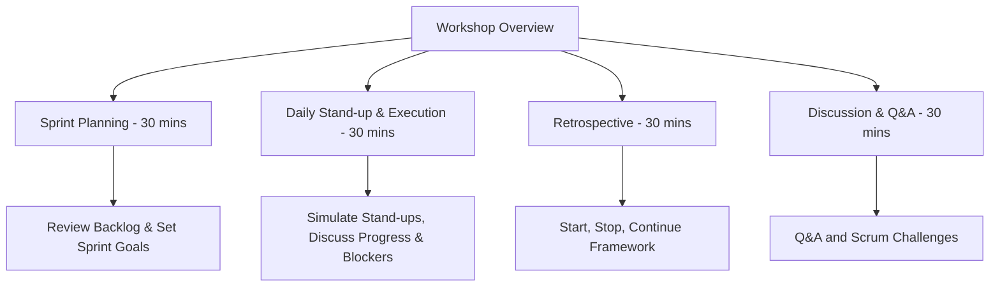
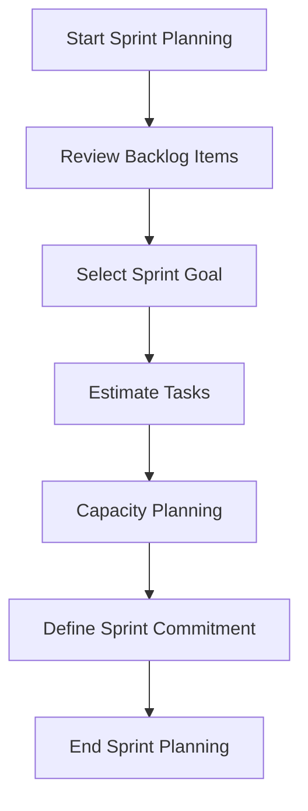
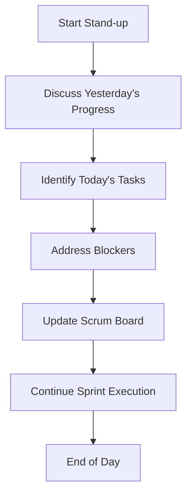
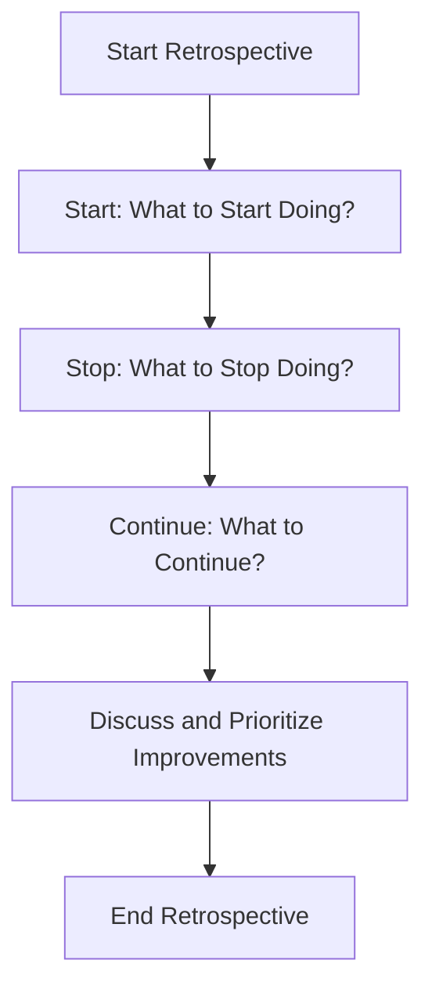
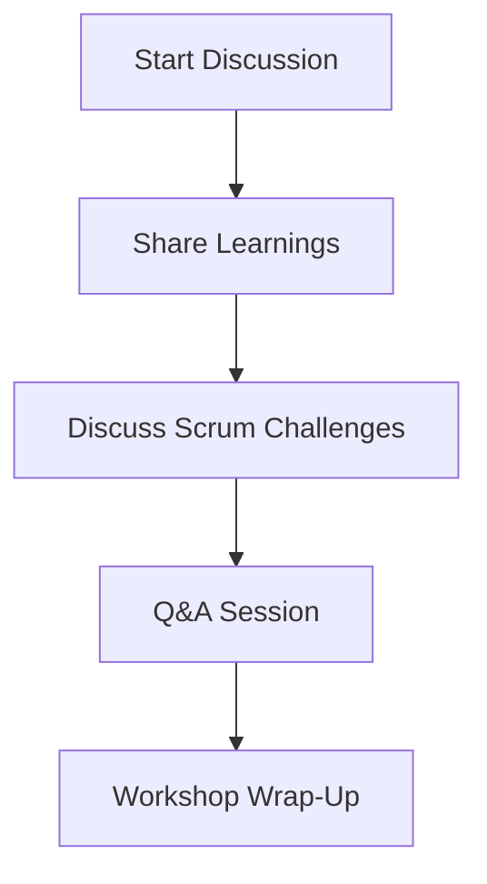
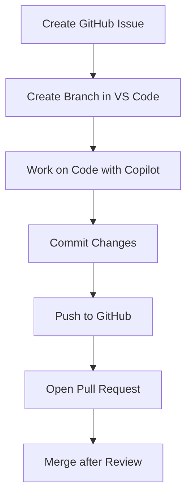
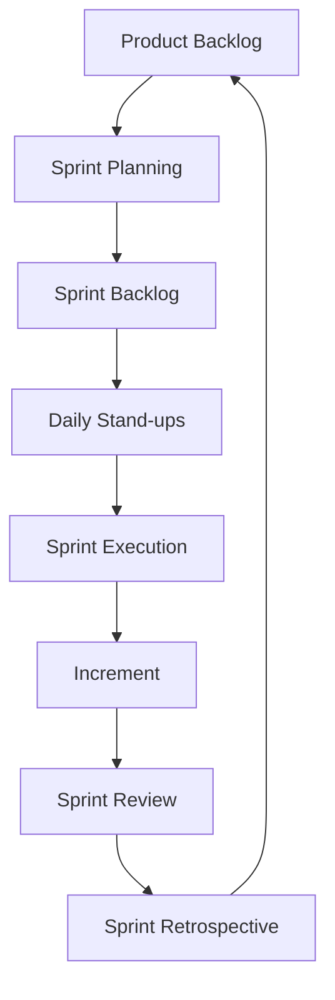

# Scrum Workshop Plan with GitHub Integration

## Index
1. [Summary](#summary)
2. [Workshop Agenda](#workshop-agenda-2-hours)
   1. [Sprint Planning Mock-up](#sprint-planning-mock-up-30-min)
   2. [Daily Stand-ups & Sprint Execution](#daily-stand-ups--sprint-execution-30-min)
   3. [Sprint Retrospective Mock-up](#sprint-retrospective-mock-up-30-min)
   4. [Discussion & Q&A](#discussion--qa-30-min)
3. [GitHub Integration Workflow](#github-integration-workflow)
4. [Detailed Scrum Process Flow](#detailed-scrum-process-flow)
5. [Key Takeaways](#key-takeaways)

---

## Summary

This workshop is designed to train the team on our Scrum practices, with a focus on practical exercises and integration of VS Code, GitHub, and Copilot. The workshop includes mock sessions for sprint planning, stand-ups, sprint execution, retrospectives, and practical GitHub workflows.

--- 

## Context

It we follow some simple guidelines and give our staff clear procedures, we can improve our project execution, prevent overruns etc:

1. **Sprint planning:** There should be a proper sprint planning session in place for each project. This will be a 1-2 hour call **before** each sprint where all the work for the coming sprint will be planned, sized and understandable by the people that it will be allocated to.

2. **Daily Standups:** They are supposed to provide accountability for the things staff promised to do the previous day and transparency about what they will do today. With the written standups, (which we keep for reference) it is very labour intensive to PMO to crosstabulate what is written with the scrum board status. It is thus better to have a daily 15 standup on video call to run through all the team's status and next tasks. These calls should be strictly time boxed.

3. **Time Logging:** In the longer term we would like to capture timesheet logged hours direct from GH issues closed. We need to hold the staff accountable for doing work in X hours if they promised X hours. Each ticket is like a mini contract and if they want to deviate from it there should be a negotiation with the PM in terms of "wont do", "can't do", "need more time", etc. This will take a while to implement, but in the mean time coming up with some simple metrics of how many story points were closed by each dev should let you see when people are not being productive.

4. **Ticket Writing:** Ticket writing is a difficult art, but each ticket should be descriptive enough that the person being tasked understands all of the requirements. In some cases just a title may be enough, but in most cases they should have a proper technical description, diagrams, wireframes etc. We are all responsible for writing tickets but the PM is responsible for NOT assigning tickets that are not adequately explained for a developer to implement. Developers should raise tickets as they work wheb they realise that new tasks will need to be done.

5. **Sprint Retrospectives:** At the end of each sprint we should be holding retrospectives to review what work was done. Invite stakeholders to the retrospectives to show of the version increment. e.g. Inviting me along to look at the cemetry app as it was being built would have been wonderful. Like a standup, a retrospective should also have 3 questions: **What should we stop doing, what should we start doing and what should be continue doing?**

6. **Client management:** Things will change in the project as requirements emerge, priorities shift etc. But we need to do a series of mini negotiations with the client as the project runs to shift time between buckets, write amendments if needed/possible etc. We do this so that we are always operating inside the parameters of the project.

7. **High Level View:** The PMO lead should focus on the high level view. Check the task progress indicators like burn downs, make sure milestones are met by meeting with the PMO team weekly and checking through all the projects and their execution states. Bubble any issues up to management as needed. You should not be operating at the ticket level but at the board / project level. 

8. **We support you:** We are here to support you, if you need help please shout. Especially for technical things  or client check ins, please let us know when you need something.

---

## Workshop Agenda (2 Hours)

1. **Sprint Planning Mock-up (30 min)**

- **Goal**: Simulate a sprint planning session, where the team reviews a mock backlog, selects tasks, estimates them, and sets sprint commitments.
- **Activities**:
    - 5 min: Review mock backlog (3-4 user stories).
    - 10 min: Prioritize tasks and define the sprint goal.
    - 10 min: Estimate tasks using story points.
    - 5 min: Finalize sprint commitments based on capacity.

2. **Daily Stand-ups & Sprint Execution (30 min)**

- **Goal**: Simulate daily stand-ups and sprint execution.
- **Activities**:
    - 5 min: Introduction to the stand-up format.
    - 10 min: Simulate two daily stand-ups.
    - 10 min: Discuss blockers and task progression.
    - 5 min: Reflect on sprint execution.

3. **Sprint Retrospective Mock-up (30 min)**

- **Goal**: Reflect on the sprint using the "Start, Stop, Continue" framework.
- **Activities**:
    - 5 min: Introduction to the framework.
    - 10 min: Participants share items for each category.
    - 10 min: Group discussion on improvements.
    - 5 min: Summarize feedback.

4. **Discussion & Q&A (30 min)**

- **Goal**: Reflect on the workshop and discuss challenges with Scrum implementation.
- **Activities**:
    - 10 min: Share key takeaways from the workshop.
    - 10 min: Discuss common Scrum challenges such as over-commitment and blockers.
    - 10 min: Open Q&A session.

---

## GitHub Integration Workflow

Here, we focus on integrating GitHub into the development workflow using VS Code and Copilot, showing how to manage issues, branches, and pull requests (PRs).

- **Goal**: Use VS Code to integrate with GitHub and GitHub Copilot, managing the workflow from issue creation to pull request.
- **Activities**:
    - Create issues directly from VS Code using GitHub extension.
    - Create a new branch for the issue.
    - Use Copilot to help write code based on the issue description.
    - Commit and push changes to GitHub.
    - Open a pull request directly from VS Code and review it with the team.

---

## Detailed Scrum Process Flow

This diagram illustrates the full Scrum process from planning to review, helping visualize how each event fits into the cycle.

- **Sprint Planning**: Set the sprint goal and define the sprint backlog.
- **Daily Stand-ups**: Daily check-ins to assess progress and blockers.
- **Sprint Execution**: Development work is done to meet the sprint goal.
- **Sprint Review**: Review the increment with stakeholders.
- **Sprint Retrospective**: Reflect on the sprint and identify improvements for the next cycle.

---

### Key Takeaways
- By the end of the workshop, participants will have hands-on experience with the Scrum framework and GitHub workflows.
- The team will learn how to streamline their development process using modern tools and focus on continuous improvement.