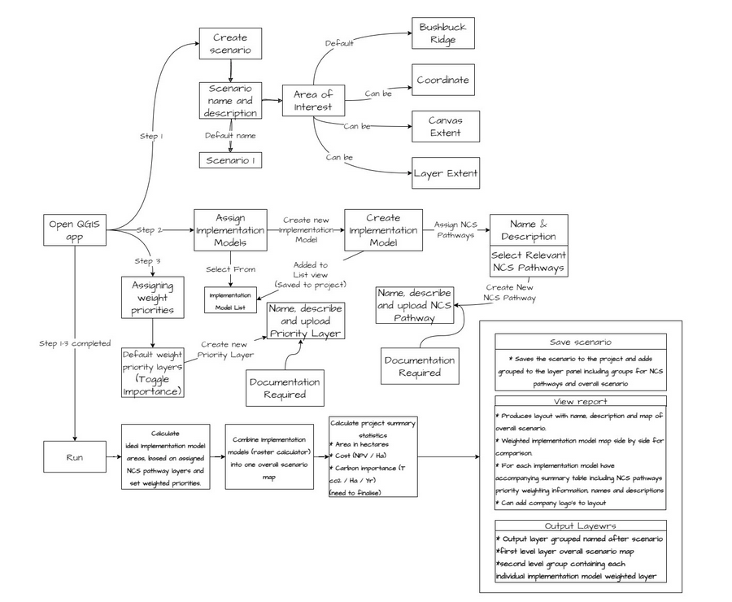

# Improving our workflows

## Dev Team

* Time budget awareness
* Contngency time
* Escalating issues when you are hard blocked
* Need better buffer with clients in terms of delivery planning - let clients know that we work 7 hours a day or need contingency. Need to account for 0.5 day technical debt, internal calls, admin etc. Make use of Marina to communicate this to client.
* PMs need to ensure that sufficient team members are allocated to meet project timelines
* Importance of following design
* Allocating resources to a team who are inefficient derailing
* Enforcing that clients abide by scope of work
* Ensure that contracts have terms to limit scope of work to a time budget
* Figure out how to ignore the urge to add 'extra' features
* Recognising with your task is going to take longer than planned size
* How to communicate scope changes about task size 
* Developers should recognise out of scope requests and offer the client the opportunity to create a new contract / contract extension
* Delivering quality work, not just doing the bare minimum
* Use your PM to proxy communicate with clients when needed
* Develop skills in sizing tasks. Always break down tasks into atomic units. You get a psychological advantage of closing off lots of small tasks.
* Learn to hack your own brain to keep yourself motivated and be able show client regular progress
* We should match the skills of our team to projects requiring their skills and not assign tasks where they will have to spend too much time learning new technologies not familiar to them.

## GIS Team

* Quoting for digitising work: Break the country / region into 30km2 and calculate around 2 days per block. Then add another 2 days for QA per regions.
* Project kick offs:
  * Drawio meeting where we have a high level but technical project overview discussion and expectations setting
  * 
  * Where project scope is unclear, there should be a budgeted activity for scope clarification and the scope should be firmed up with the client before starting actual work. Marina should be in the loop on this so that we can hold the client accountable to limit the scope to what we have agreed.
  * Clients should be given parameters for engagement: fixed number of iterations e.g. for review, deadlines for design requirements, clear communication as to when activities have been budgeted for.
* Plan for learning curves in new technology 
* Build in expert time in projects to swiftly bypass blockers
* Escalate problems efficiently so that you dont stick on things for days that a team mate could solve in minutes

# Training

* Training packages need to be properly setup - Abi needs to review the pack system that Charlie setup 
* Training packages need to be efficient in the training environment e.g. zips already unzipped
* Onsite training prep pack: cable adapters etc. and also pre training lab check
* Learner levels should be managed so that we dont mix levels in a group
* Prefiltering learners with a survey / questionnaire to prepare for what levels learners are
* Advertising drive at the start of the year
* **SAQA certification** we are suckers without SAQA / SAGC / SACE
* Early bird discounts
* Post all courses at the start of the year
* Post training surveys
* Liven up the training area of the site with interviews and cool media
* Referral swag or free training for refers
* Price sensitivity - our prices seem reasonable compared to competitors
* Mention on the site we have discounts for schools / edu (specify costs)
* Moodle and platforms like GeoNode training etc need continuous maintenance - test data wiped regularly etc.

## Infrastructure

* GIS infrastructure needs need to be shared with Leon
* We underutilise our GIS infrastructure and we should look for ways to leverage it more
* Geoserver and Geocontext are used for clients too, but should we have different infrastructure for clients?
* sagta map downloader
* data downloader (by Charlie)
* staff need to be familiar with our infrastructure to know how to leverage it in work and sales

# Devops

* Level up our SDLC maturity level to allow us to provide more robust solutions
* Migrate to new infrastrcture Q1 MVP, Q2 Migrations
* Optimised local environment managed by devops so devs can be productive within a day
* Operational Areas:
  * Kartoza inhouse systems (should be behind VPN e.g. NC)
  * Kartoza common infrastructre (e.g. postgis.kartoza.com) that can be client facing
  * Developer tools / developer local env
  * Training deploy and scrub platforms
  * Bespoke Client Hosted Applications
  * Generic Client Hosted Applications
  * Kartoza Hardware Inventory
* Communication plan for clients with the upcoming migrations
* Communication plan for developers on processes and workflows for SDLC
* Application catalogue for everything we manage with details of who the client is, what the billing regieme is, who the internal owner is, where the documentation is etc. Workflow for new infrastructure needs to include maintaining the application catalogue. Every application and resource deployed should be tagged with an app id which is tracable back to the app catalogue.
* Can we use ERP next for the above?
* Goal to have no orphaned infrastructure
* Standardising architectures as much as possible
* Need to be able to specify per-region deployments where customer constraints require it
* Observability needs to be built into the stack from the ground up (dashboards, alerting, log views)
* Devops environment needs to be documented from the ground up
* 

# Management

* Automation of standup history in timesheet app
* Implementation of planner sheet integrated with ERP Next in timesheet app
* Burn down charts in timesheet app
* Strong focus on team leader roles
* Focus on building our team communication skills (not only in the technical sense but in being proactive communicators)
* Internal training e.g. Seabilwe presenting basic GIS skills to non GIS staff
* Succession planning: To ensure that the company does not have reliance on a single person
* Put in place mechanisms to onramp developers efficiently into our devops stack e.g. developer VMs
* Proposal development:
  * Internal testing: plan to include testing as a standard and integral part of every project, budgeted as a line item. Testing blowback (developer work that results in lots of failed tests) should reflect in developer KPI's
    * Functional testing in CI
    * Regression testing in CI
    * Workflow testing in CI (using Playwright)
    * Integration/Deployment testing using DevOps / ArgoCD
    * Manual testing with a test script
  * Two weeks at end of contract for sign off
  * Client management: we need to ensure that our contracting and project plans manage expectations of clients and that contracts halt until each phase is signed off
  * Proposal development should factor for 7 hour days not 8 in the project plan
* Look for standardisation in project technology:
  * Devops SDLC
  * Django
  * Postgres / GIS
  * ReactJS
  * MapLibre
  * Vector Tiles
* Establish spaces for the company to hang out together
* We need a plan for security:
  * Securing staff computers - policies and communication with staff about best practices - 
      * local disk encryption
      * have I been pwned checks
      * require password managers
      * strong password requirements
      * etc.
  * Security at network level:
    * Internal systems (NC, Gdrive, ) requireing YubiKey
    * Move internal systems into VPN
* Share incentive scheme in place in 2023
  * Preferential shares eligible for dividends and bonuses
  * Shares vest when the company lists on the stock exchange (not applicable for us?)
* Establishment of Kartoza.eu and managing impact on Kartoza.za
* Team meet up
* Sales handovers - standardize the handover of new work coming in
  

