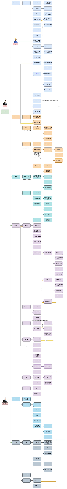

# Project Documentation

The diagram below is the overall structure for project documentation

For the template to create project documentation refer to the `docs` section of the [django-react-base](https://github.com/kartoza/django-react-base) repository.
