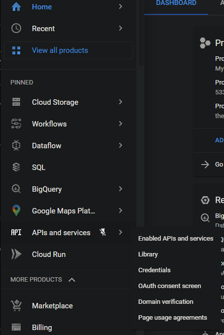

# Google cloud platform guide

A guide for Google cloud platform (GCP).

## APIs and services
When using working with GCP, the user will need to enable the APIs required for the features they will be using.
Here is a list of APIs the user will need to activate for storage, workflows, dataflows, and triggers.

- Cloud:
  - Cloud Pub/Sub API
  - Cloud storage
  - Cloud logging API
  - Cloud storage JSON API
  - BigQuery API
  - Cloud datastore API
  - Compute Engine API
- Workflow:
  - Workflow API
  - Workflow executions API
  - Eventarc API
  - Cloud scheduler API
- Dataflow:
  - Dataflow API

> This does not mean the user needs to make use of all these APIs, it only points out important cases

To activate any of the above, do the following:
- On the dashboard, click on **APIs and services**

- Select **Library**. This will take the user to a library which contains the available APIs
- The simplest method, if the API name is known, is to search for the API in the search bar
- For this guide, type “Cloud pub/sub api” in the search bar and press **Enter**

- Select the *Cloud Pub/Sub API* result
- Click **Enable**
- Do this for all required APIs and services

If an API is required for a function by GCP which has not been activated, the user will be prompted to enable it.

## Cloud storage

### Create a new bucket

How to create a Storage bucket:
- Go to **Cloud Storage** and click on **Browser**

- Click **Create bucket**

- Provide a unique name for the bucket and click **Continue**
- Choose a region of your choice and click Continue

> Using a single **Region** type will be the most cost-effective option.
> Only use **Multi-region** when required.

- The user can decide on the storage type, storage class, access control and data protection which will suffice for their requirements

> Default parameters/options should be sufficient for most cases.
> It is also important to consider the different storage classes, as this can affect the cost.

| Storage class    | Minimum storage duration (days) | Retrieval fees (per GB) |
| ---------------- | :-----------------------------: | ----------------------- |
| Standard storage |              None               | None                    |
| Nearline storage |               30                | $0.01                   |
| Coldline storage |               90                | $0.02                   |
| Archive storage  |               365               | $0.05                   |

- Click **Create**

For more information on Cloud Storage and buckets, see https://cloud.google.com/storage/docs/json_api/v1/buckets.

### Load data into a bucket

- Select the bucket to which data will be added
- Click on **Create folder**
- Open the newly created folder
- Click **Upload files**
- Select the file which needs to be stored in the bucket, and click **Open**. The file will be uploaded to the bucket

- The file can be renamed as follows:
  - To the right, open the **object overflow menu** (button with three dots)
  - Select **Rename**
  - Rename the file as desired
- A file can be deleted from the bucket by selecting it (tick next to the file) and clicking on **Delete**

## Workflow

This sections deals with creating a workflow in GCP.

- In the GCP menu, click on **Workflows**

- Click **Create** to start setting up a workflow

- Provide a workflow name, description (optional) and region

> Using a single region option is a more cost-effective approach.
> Only use multi-regional if required.

- Select a service account. Do the following if you want to create a new service account:
  - Click on **Create a new service account**
  - Provide an account name, ID and description (optional). The user can also generate a random ID.
  - Click on **Create and Continue**
  - Now select the newly created service account

> Description parameters are optional, but it is highly recommended to provide a good, but short description.
> This helps a lot if multiple users will be working on the GCP project.

- The user can also provide a label to link this workflow to a group. This is optional.
  - Click on **Add label**
  - Provide a **Key** and **Value**
- GCP provides two trigger types:

- Choose either type:
  - *Cloud scheduler*: This is a recurring schedule option
    - Click on **Add new trigger** and select **Cloud scheduler**
    - Provide the following:
      - A **name**, **region**, and **time zone**
      - The **frequency** needs to be set as explained here: https://cloud.google.com/scheduler/docs/configuring/cron-job-schedules#defining_the_job_schedule
      - Click **Continue**
      - Set the **workflow argument**, **log level** and the **service account** as desired
      - Click **Create**
  - *Eventarc*: This is an event driven option (e.g. file uploaded to a bucket)
    - Click on **Add new trigger** and select **Eventarc**
    - Set the **Trigger name** as desired
    - Choose an **Event provider**. Depending on the chosen provider, the parameters which follows may differ. For this example/guide Cloud Storage will be used
    - Under **Event**, the user will note that there are numerous options, but for now we will use google.cloud.storage.object.v1.finalized – This event occurs when a new object has been created in a bucket
    - To select the bucket which should be monitored, click on **Browse**. Then select the desired bucket, or create a new bucket. Click **Select**
    - Choose the Service account
    - Grant permission as required for the chosen **Region** and **Service account**. If permissions are already set up, this option will not show to the user
    - Click **Save trigger**
- Set up the workflow which needs to be performed. See the following for more information on this: https://cloud.google.com/workflows/docs/reference/syntax
- Click **Deploy**
- If the workflow has been successfully deployed, the user can perform the workflow. Click on **Execute** to go to the execute workflow section

- Click **Execute**
- Here is an example of an output from a Workflow

## Dataflow

The GCP dataflow can be split into three main categories, namely Java, Python and notebooks.
Essentially the outcome and aim of each category will be the same.
For this guide focus will be on Python.

> To enable dataflow developing for an account, add the Dataflow developer role to the service account.

Here is a short tutorial on creating a **Dataflow**:

- Let's first create a text file which will contain some words for our example:
  - Create a new text file at a desired directory on your computer. The text file name can be anything (e.g. “just_some_text.txt”);
  - Add some words to the text file. Which words you add does not matter, but here is an example:

- Upload the new file:
  - Open Cloud storage
  - Open an existing bucket, or **create a new bucket**
  - Click **Upload files**
  - Select the newly created text file and click **OK**
- Create a tempory storage folder for **Dataflow**:
  - Click on **Create folder** and name it "temp"
- On the dashboard, click on **Dataflow**

- Click on Create job from template

> A user can also create their own template, but for this example we will not be doing that.

- Provide a **Job name**
- Choose a **Regional endpoint**

> The region will be best to be the same as your cloud storage. This will minimize costs.

- Set the **Dataflow template** to Word count. The Word count dataflow will execute code on a provided text file and return the number of cases the file contains each word
- To set directories the syntax will be “gs://{bucket}/{folder}/{filename}”. For example, “gs://newb2/just_some_text.txt” will refer to the text file named ‘just_some_text.txt’ in the bucket named ‘newb2’. These directories can also refer to folders in a bucket. Set the directories as follows:
  - **Input file(s) in Cloud storage**: The text file which contains the words (e.g. “gs://newb2/just_some_text.txt”). This will be the input for the dataflow
  - **Output Cloud Storage file prefix**: This is the prefix which will be used for the output file (“gs://newb2/just_some_text_result.txt”). The counts for each word will be stored in this file
  - **Temporary location**: Provide the temporary folder we created here (“gs://newb2/temp”). The dataflow will use this folder to store any temporary data used for processing
- Here is an example of the parameters:

- Click **Run job**
- The job will run for a few minutes. The output should be similar to the following:

- Once the dataflow finished running, go back to your bucket. There should be a new file, based on the name you have provided, in your bucket. In this example, the file is named “just_some_text_result.txt-00000-000001”

- Download the file
- The user should see something similar to the following:

This concludes the basic example for **Dataflows**.

## BigQuery

### Create a new table

- Click the **View actions** button for the project
- Click **Create data set**

- Select the **Project ID**
- Provide a **Data set ID**
- Select a **Data location** (region)

> For cost-effectiveness, make use a single zone region. Multi-region is more costly.

- Click **Create data set**

- Click **View actions** for the newly created data set;
- Click **Create table**;

- Provide the required parameters and click on **Create table**

> A dataset can contain multiple tables.

### Table schema

The schema for a table contains all of the fields, field types, size, description, and other parameters based on the field type.
To add or edit a Schema to the table, do the following:

- Click on the table so that it opens in a new tab in GCP
- Click **Edit schema**

- Click the **Add field** button
- Provide a **Field name**, **Type**, **Mode** and **Description**. Some schema options might be optional (e.g. **Description**). The parameters will also differ depending on the Type;
- The user can add several fields;

- Click **Save** to update the Schema

### Notes

Some issues the user should avoid or may encounter:
- BigQuery will not allow loading of a table with the incorrect number of columns:
  - Deleting unwanted fields will solve this problem
  - Always base the schema on the table being loaded, but this can introduce other issues
- The names of each field needs to be the same. So the user needs to check the data prior to uploading it. This will also make it easier to automatically delete unwanted fields
- The data type needs to be the same for all features/rows of the table. A string cannot be imported into a float fields type
- Found an issue where the number of columns changes from a certain row (e.g. row 81), therefore the data cannot be loaded. These were resolved by ‘just deleting’ a bunch of columns at the end of the file. Could not find any data in those columns, so not exactly sure what caused to problem (maybe spaces or tabs in the table elements)
- Most of these issues can be solved prior to uploading data, or in the Python code itself when a trigger event occurs
- Issues when importing a date column. BigQuery needs the data to be perfect for improting.

## Python

Python can be used for trigger events for **Storage bucket** or **Dataflow** pipelines. Other languages, namely Java, are also supported.

### Locally run python code

Python code can be run locally before running it on the GCP. Makes it easier to test code before uploading it.
Firstly the user needs to create a service account JSON file, followed by setting up environmental variables in their OS and installing a few libraries/modules.

#### Service account key

The service account key will be used by the user’s OS to access the GCP account. The JSON key can be created as follows:
- Go to **IAM and admin**
- Select **Service account**
- Select the service account for which you want to create the JSON key
- Click on the **Keys** tab
- Click Add key and then **Create new key**
- Select JSON and click **Create**
- The new key will be created and the browser will download the JSON file

> If the download fails, try using a different browser as some browsers causes issues.

#### Environmental variables

Windows environmental variables needs to be set up as follows:
- Type ‘environmental variables’ in the Windows start menu
- Select **Edit the system environmental variables**
- Under _System variables_, click **New**

- Set the variables as follows:
  - Service account JSON key:
    - **Variable name**: GOOGLE_APPLICATION_CREDENTIALS; and
    - **Variable value**: Directory with filename to the JSON key file.
  - GCP project:
    - **Variable name**: GOOGLE_CLOUD_PROJECT; and
    - **Variable value**: Project ID.

- Click **OK**
- The new environmenal variables will now be added

On Linux the user can do the following to set up the environmental variables:
- Open the terminal
- Service account JSON key:
  - Run the following: export GOOGLE_APPLICATION_CREDENTIALS="KEY_PATH", where KEY_PATH is the directory to the JSON key file
- GCP project:
  - Run the following: export GOOGLE_CLOUD_PROJECT="PROJECT", where PROJECT is the ID of the project.

Accessing the GCP using Python code should now work.

#### Python modules and libraries to install
Required roles:
- Dataflow admin;
- Dataflow developer;
- Dataflow worker; and
- Service account user.

Install pip, if not installed:
- sudo apt update
- sudo apt install python3-pip

The following Python modules will be required:
- pip install google-cloud-storage;
- pip install google-cloud-bigquery; and
- pip install google-cloud.

These modules should be installed locally if the user wants to perform Python runs locally, but also on the GCP terminal when code should be run on the platform as well. To check the list of installed Python modules, use ‘pip list’.

The following libraries should be installed for local Python runs:
- gcloud command:
  - sudo snap install google-cloud-cli; and
  - sudo snap install google-cloud-sdk.

If the user will be making use of Apache-beam (Data flow pipeline), do the following to be able to run code locally:
- Open the console;
- pip install wheel;
- Installing Apache-beam differs for Windows and Linux:
  - Windows: pip install “apache-beam[gcp]”; and
  - Linux: pip install ‘apache-beam[gcp]’.

> Take note that Windows uses a souble-quote, Linux uses a single-quote.

#### Running the code locally

Before adding code to GCP (e.g. for a trigger), it will be best to test the code locally as it can be slow to upload or deploy the code. Simply run the Python code using the normal console command:
- python3 python_file.py

### Bucket trigger events

A trigger event can be set up for a Storage bucket. Depending on the event (e.g. object.finalize will occur when a new file finished uploading to the bucket), code can be triggered. This guide will only explain how to do this for Python, but it can also be set up for other languages (e.g. Java).
Add required roles:
- cloudfunctions.functions.get
- cloudfunctions.functions.create
- cloudfunctions.functions.delete
- cloudfunctions.functions.call
- Any other required roles

#### Trigger event for Python

A trigger event for Python can be set up as follows:
- _main.py_: This Python file will contain the functions which will be triggered when an event occurs. The file has to be named main.py.
- _requirements.txt_: This file will consist of any modules which will be imported and used by the code. Here is two examples of requirements added to the text file:
  - google.cloud.storage
  - google.cloud.bigquery

- The code can be deployed by going to Cloud functions in GCP;
- The code can also be deployed on the GCP to the bucket using the following command:
gcloud functions deploy FUNCTION_NAME \
--runtime python39 \
--trigger-resource BUCKET_NAME \
--trigger-event TRIGGER_EVENT \
--project PROJECT_ID

- The user can manually upload the data to the bucket or use the following command:
gsutil cp FILE_NAME BUCKET_DIR
- To check the logs of the trigger, do the following command:
gcloud functions logs read --limit 50 --project PROJECT_ID
- Variable descriptions:
  - **FUNCTION_NAME**: The name of the method/function in the main.py file;
  - **BUCKET_NAME**: The name of the bucket which will trigger the event. This should only be the bucket name (e.g. example_bucket);
  - **TRIGGER_EVENT**: The event which will trigger the code (e.g. google.storage.object.finalize will trigger when a file finished uploading);
  - **PROJECT_ID**: The ID of the project (not the name of the project)
  - **FILE_NAME**: The local file the user wants to upload; and
  - **BUCKET_DIR**: The bucket directory on GCP. This will consist of ‘gs://’ and the BUCKET_NAME (e.g. gs://example_bucket)

### BigQuery in Python

This section will deal with BigQuery in Python code.

The table schema, basically the attributes structure, is important to set up correctly in BigQuery and will cause issues if the user attempts to load a table into BigQuery using the incorrect structure for the table being loaded. A table schema makes use of JSON, and is easy to set up. Here is a code example:

SCHEMA = [
        bigquery.SchemaField('Date', 'Date', mode='NULLABLE'),
        bigquery.SchemaField('Max_Temperature', 'FLOAT', mode='NULLABLE'),
        bigquery.SchemaField('Min_Temperature', 'FLOAT', mode='NULLABLE'),
        bigquery.SchemaField('Precipitation', 'FLOAT', mode='NULLABLE'),
        bigquery.SchemaField('Relative_Humidity', 'FLOAT', mode='NULLABLE'),
        bigquery.SchemaField('Solar', 'FLOAT', mode='NULLABLE'),
        bigquery.SchemaField('Streamflow', 'FLOAT', mode='NULLABLE'),
]
