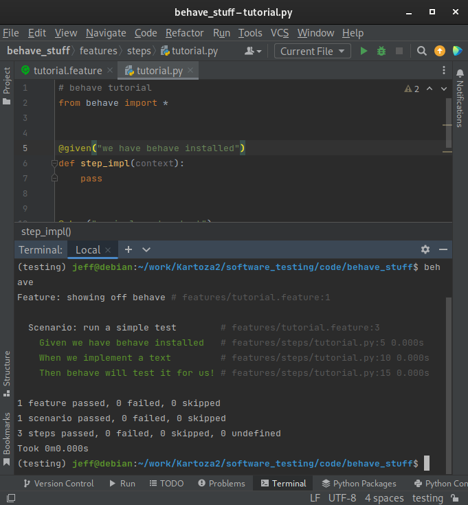
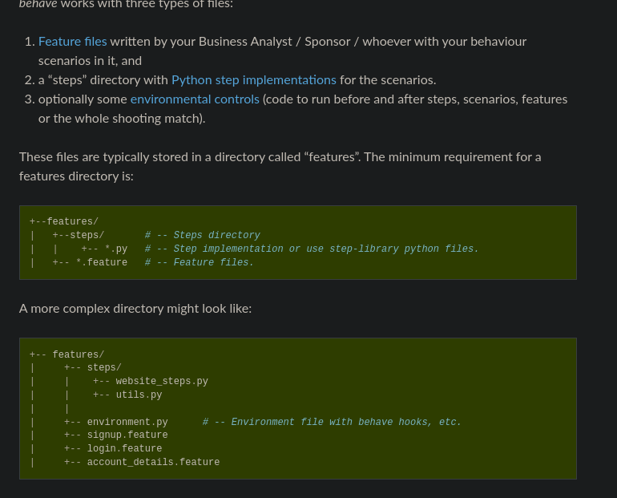

# Behaviour driven development

## Introduction

Behavioural-driven development (BDD) is an agile software development technique.
BDD encourages the collaboration between the developers and the client.
BDD focuses more on clear understanding of software behaviour through discussion with the client.

> It extends TDD by writing test cases in a natural language that non-programmers can read.
> Behavior-driven developers use their native language in combination with the ubiquitous language of domain-driven design to describe the purpose and benefit of their code.
> This allows the developers to focus on why the code should be created,
> and minimizes translation between the technical language in which the code is written and the domain language spoken by the business, users, stakeholders, project management, etc.
> Source, [BDD philosophy](https://behave.readthedocs.io/en/latest/philosophy/).

The developer should break customer requirements into simple examples using Gherkin.
[Gherkin](https://cucumber.io/docs/gherkin/reference/) is a business-readable,
domain-specific language created for behaviour descriptions.
Gherkin communicates to the developer in a human-like language.

[Behave](https://behave.readthedocs.io/en/latest/) is a tool implemented in python to make all this possible.


## Installation

Behave installation:

- Created a new conda environment:
```bash
  conda create -n testing python
```

- Installed `behave` using pip
```bash
  pip install behave
```

## Gherkin Feature Testing language

Features are made up of scenarios:
```Gherkin
  Feature: feature name
	  
    Scenario: some scenario
      Given some condition
       Then some result is expected.
```

An example:

- Make `features` directory
- Make `tutorial.feature` file inside features directory
- Copy sample feature scenarios to `tutorial.feature`:
```Gherkin
Feature: showing off behave

  Scenario: run a simple test
     Given we have behave installed
      When we implement a test
      Then behave will test it for us!
```

- Make a new directory `features/steps` and create `tutorial.py` file.
- Copy below code:
```python
from behave import *

@given('we have behave installed')
def step_impl(context):
    pass

@when('we implement a test')
def step_impl(context):
    assert True is not False

@then('behave will test it for us!')
def step_impl(context):
    assert context.failed is False
```

- Run code in the directory:
```bash 
behave
```

- The results would be as follows:



For a more comprehensive tutorial, kindly look at [behave tutorial](https://behave.readthedocs.io/en/latest/tutorial/)

- **NOTE:** [Testing layout](https://behave.readthedocs.io/en/latest/gherkin/).



## Django test integration

- There are two projects that integrate django and behave:
	- [django-behave](https://github.com/django-behave/django-behave/blob/master/README.md#how-to-use)
    - [behave-django](https://behave-django.readthedocs.io/en/latest/installation.html)
