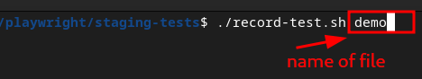
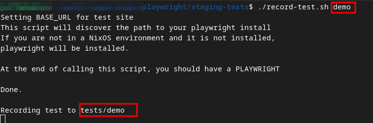
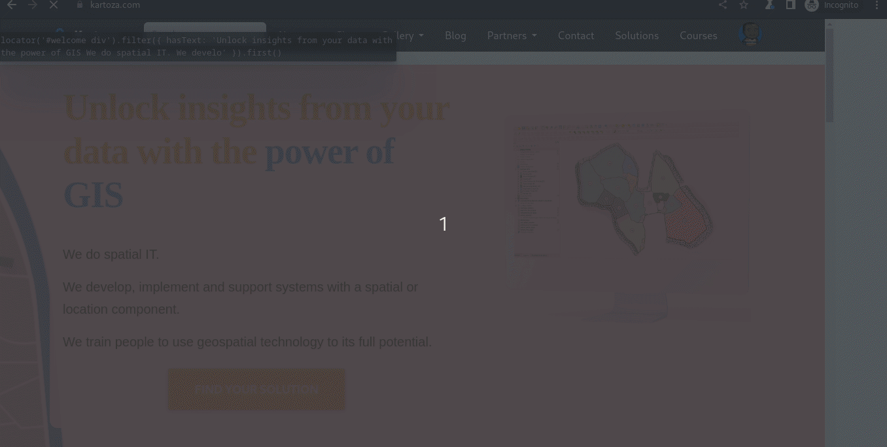
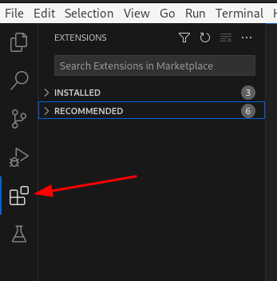
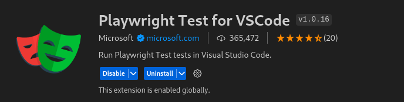
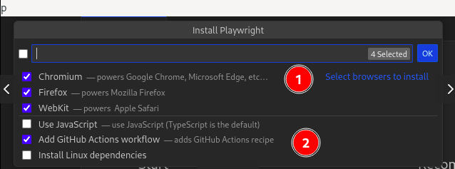
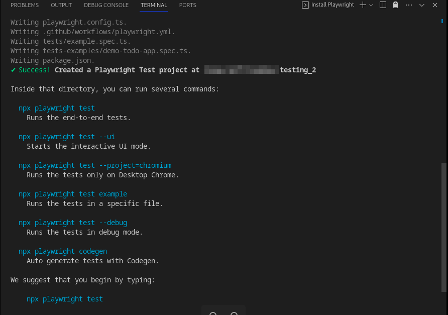
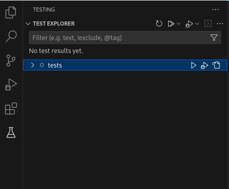

# End-to-end testing

## Introduction
[E2E](https://www.techtarget.com/searchsoftwarequality/definition/End-to-end-testing)
verifies working order of a system from start to end,
taking into account real world scenarios the system can run(simulate user experience)

Most of the projects of the applications at the company are mainly in Django with a React frontend.

To accomplish E2E testing, we use [playwright](https://playwright.dev/).
It supports all the major browsers used today.

## Getting started

To get started with Playwright, you need to ensure you have playwright installed in your device locally.
There are a variety of playwright packages, but as per our standards, we will use Playwright Node.js package.

### Installing Node.js

To set up Node.js in Debian/Ubuntu or Fedora,
the binary distributions for Node.js are available at [Nodesource](https://github.com/nodesource/distributions).
The binary setups are directly installed.

For NixOS, the configuration can be found at [NixOS packages](https://search.nixos.org/packages).
You can go ahead and search for the Node.js version best suited.
The configuration for that package is then added to `etc/nixos/configuration.nix`.
```nixos
environment.systemPackages = [
    pkgs.nodejs_18
  ];
```

For NixOS users, it is an added advantage if `direnv` is installed.
When you navigate into the specific directory e.g., ci-tests, your environment will be set up.

**NOTE:** For this to work for Nix-OS users, ensure the directory has an `.envrc` and `default.nix` file.
`shell.nix` file also works.


### Installing playwright using npm

At the root of your project directory `Project`, navigate to `playwright`.

```bash
cd playwright
```

In the `playwright` directory, there are two more directories:

```bash
$ ls
ci-tests staging-tests
```

To set up a new playwright project use:
```bash
npm init playwright@latest
```

To configure playwright step by step, you will have to:

- To install all browsers and all its dependencies:
```bash
npx playwright install --with-deps
```

- To install one browser and its dependencies
```bash
npx playwright install chromium --with-deps
```

### For Continuous Integration(`CI`):

Playwright does support Continuous Integration.
For more information, visit the [playwright ci docs](https://playwright.dev/docs/ci-intro).

Navigate to `playwright/ci-tests` directory.

In the directory ensure the below files are present:

```bash
$ cd ci-tests
$ ls
package.json playwright.config.ts
```

Then you can proceed with setting up playwright:

- To update npm dependencies
```bash
npm install
```

- To install CI dependencies
```bash
npm ci
```

- To install playwright package, browsers and linux dependencies
```bash
npx playwright install --with-deps
```

- To run tests:
```bash
npx playwright test
```
By default, this test will run in `headless` mode(No browser will be opened).

### For staging tests

In setting up environment for staging tests, it uses the same approach as in setting up for CI.
The only difference is that installing dependencies for CI won't be required.

**NOTE:** Both `ci-tests` and `staging-tests` directory will have scripts to assist in setting up the environment easily.
The scripts are:
- `create-auth.sh`: Used to create a cookie file with the session state saved.
- `record-test.sh`: Used to record new tests.
- `run-tests.sh`: Used to run tests.

These scripts check if you have the required environment is set up, if it is not, the script will set up everything.
After setting up the environment, the script will proceed to run the next step.

- Start off by creating the session state file.


  1. Shows how to run the script in your terminal
  2. The script will prompt you if you want to save the `auth.json` file.

- Proceed to log in.


- The `auth.json` will be created. You can then proceed to record your tests.


- To record your tests, proceed to run the next script `record-test.sh`.
The script takes a name argument for the file to be created `./record-test.sh demo`.


- The script will open a browser and load the required page.
It will use the session state that was previously created.



- Click on the page elements to record a test.


- To run the tests, use `./run-tests.sh`. 


- It will open a GUI playwright test runner with all tests. You can then proceed to run the tests.


### Alternative: playwright in visual studio code

Install extension `Playwright extention`

Click on the vscode's extension icon:



Search for `playwright test`, select the below playwright test extension:


Install the extension:



On your keyboard, press `ctrl + shift + P`.
Search for `playwright`, select `Install Playwright`.


It will open up the following menu:



For option `1`: You can choose to install one or all the browsers.

For option `2`:
- Use `TypeScript` as a default(current preferred standard).
- You can enable to add `GitHub actions` if the tests are for `CI`.
- Enable to `Install Linux dependencies` if you are on Debian/Ubuntu.
You can check this option if you are installing playwright for the first time.

Press `Ok` to proceed:
It will install and set up the project.



#### Running playwright tests in vscode

To run tests in vscode, click on this testing icon.


It will scan your `tests` directory for playwright tests.



To run, click on the triangle icon:


- `1`: Lists down all tests functions. You can test normally and also debug from here.
- `2`: You can run the test functions from here.
- `3`: Shows the test results for each session.

The tests will run and the results shown.

For more information, look at the [playwright docs for vscode](https://playwright.dev/docs/getting-started-vscode).
