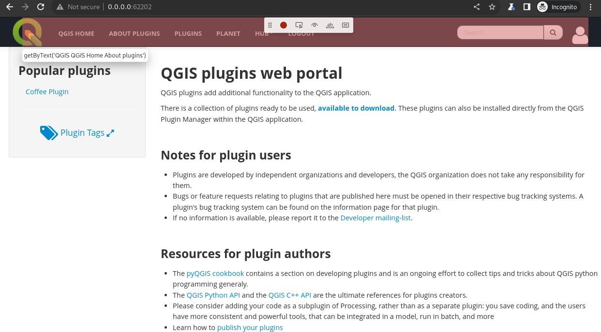

# QGIS-Django: End-to-End Testing

## Setup

To set up the project, navigate to GitHub and clone the repo. 

```bash
git clone https://github.com/qgis/QGIS-Django.git 
```
Or
```bash
git clone git@github.com:qgis/QGIS-Django.git
```

To set up a local instance, go through this [installation](https://github.com/qgis/QGIS-Django/blob/master/INSTALL.md).

After completing the installation, navigate to `playwright` directory at the root of the project.

In the `playwright` directory there are two other directories:

- `ci-test`
- `staging-tests`

In `ci-test`, the tests are meant for run in a `CI` environment such as `GitHub Actions`.

In `staging-tests`, the tests are meant to run against a staging/production environment.

For more on playwright, look at:

- [End-to-End testing](./end2endtesting.md)
- [Playwright docs](https://playwright.dev/docs/intro)

## Record tests

Navigate to `staging-tests`.

In the directory there are scripts:

- `playwright.config.ts` - Contains the configurations necessary to be able to run playwright tests.
- `create-auth.sh` - Used to create and store the session state in `auth.json` file.
- `record-tests.sh` - Used to record tests.
- `run-tests.sh` - Used to run tests.

Start off by creating the authentication file.

```bash
./create-auth.sh
```

The script open a browser instance incognito mode.
Proceed.


To record tests, run the `record-tests.sh` script and add the filename after it:

```bash
./record-tests.sh 01-plugin-landing-page
```

This will also start a browser instance where you can record tests.
When you close the browser, the generated script will be saved in the `tests` directory.



## Run tests

To run the tests:

```bash
./run-test.sh
```

The script will open playwright test runner.
You can be able to run tests from this browser instance.


## CI workflow

The project's `CI` workflow runs under GitHub actions.
Playwright has support for `CI` environments.

In this environment, `playwright` setup is defined in `test.yml`.

```yaml
name: pr-test
on:
  pull_request:
    branches:
      - master
  push:
    branches:
      - master
jobs:
  # Other jobs
  test:
    runs-on: ubuntu-latest
    needs:
      - lint
    defaults:
      run:
        working-directory: dockerize
    steps:
      # Other steps to set up base environment

      - name: Install playwright dependencies
        working-directory: playwright/ci-test
        run: |
          npm install
          npm ci
          npx playwright install --with-deps
      
      - name: Run Playwright tests
        working-directory: playwright/ci-test
        run: npx playwright test
      
      - uses: actions/upload-artifact@v3
        if: always()
        with:
          name: playwright-report
          path: playwright/ci-test/playwright-report/
          retention-days: 30
```

After the project's images have been built, the web application is spun.
`Playwright` and all its dependencies are set up in the `playwright/ci-test` directory.

All the tests are then executed.
A report is the generated and uploaded as an artifact.
This report is available for download on the summary page.

To view the report, download it into your `ci-test` directory then on your terminal:

```bash
npx playwright show-report
```

It will open a session in your browser.
For failed tests it will contain a trace file which are recorded frames of the tests execution.
The trace file is important as you can also use it to debug when a test fails in the CI environment.


Click on the failed tests.
Navigate to the first retry, as this contains the trace file.
To view the trace file, click on it.
You will be able to view all steps from that particular session.

For example, the test below failed at this particular point.


For more on playwright in CI environment look at the [docs](https://playwright.dev/docs/ci-intro).
