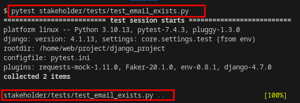
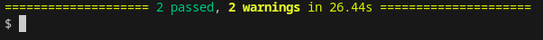

# Test-Driven Development

It is an agile technique used in the early onset of software development.

It entails creating tests for each specific function before writing the function itself.
The test is bound to fail at first, but the developer is supposed to ensure the test cases now passes when writing the function.

Test-Driven Development starts with designing and developing tests for every small functionality of an application.
TDD framework instructs developers to write new code only if an automated test has failed. This avoids duplication of code.

TDD workflow:


## TDD using pytest in django projects

### Setting up

Navigate to the `django_project` directory.

`pytest` is used to create this tests. It is quite similar to [Functional testing](functionaltesting.md).
`pytest` is installed while setting up the docker containers for the project.
Ensure `pytest-django` is added to the settings.

In the `django_directory`, you have to set up the `pytest` configuration for the project.
This is declared in the `pytest.ini` file.

Example:
```
[pytest]
env =
    DJANGO_SETTINGS_MODULE=core.settings.test
    AZURE_B2C_CLIENT_ID=
```
In this case, `pytest` uses the in-built django test cases(`core.settings.test`).

The convention for using pytest is the same:
- Test files organisation: Having a `tests/` directory in each django application.
- Naming convention for test files: `tests_<file_name>.py`
- Naming convention for test functions: `test_<function_name>` 

**Note:** Each django application in the django directory should have its own `tests/` directory.

### Adding tests

Function to be tested from a django application (`*.views`):

```python
def check_email_exists(request):
    if request.method == 'GET':
        email = request.GET.get('email', '').strip()
        current_user_email = request.user.email

        if email and email != current_user_email:
            email_exists = User.objects.filter(email=email).exists()
            return JsonResponse({'exists': email_exists})

    return JsonResponse({'exists': False})
```

Below is an example of a test case (`test_email_exist.py`:

```python
from django.urls import reverse
from django.test import TestCase                    # using django test case
from django.test.client import RequestFactory       # using request factory
from stakeholder.views import check_email_exists    # project dependent import 
from django.contrib.auth import get_user_model

# test class
class CheckEmailExistsViewTest(TestCase):
    def setUp(self):
        self.user = get_user_model().objects.create_user(
            username='testuser', 
            email='test@example.com', 
            password='testpassword'
        )
        self.factory = RequestFactory()

    # test function 
    # Note: naming convention
    def test_email_exists(self):
        url = reverse('check_email_exists')
        data = {
            'email': 'test@gmail.com',
            'csrfmiddlewaretoken': self.client.cookies.get('csrftoken', '')
        }

        request = self.factory.get(url, data)
        request.user = self.user

        results = check_email_exists(request)
        self.assertEqual(results.status_code, 200)

        expected_data = {'exists': False}
        self.assertJSONEqual(results.content, expected_data)
```

### Running tests

Navigate to the `django_project`, on your terminal run:

```bash
pytest
```


`pytest` will scan the whole project for test functions then the tests will be executed.

Results:


The results will show all tests ran, failed and passed.

To run tests on a specific module use:

```bash
pytest stakeholder/tests/test_email_exists.py
```


Results:




