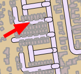
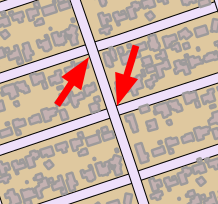
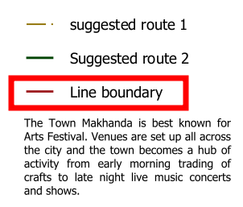
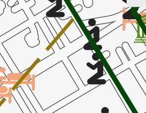
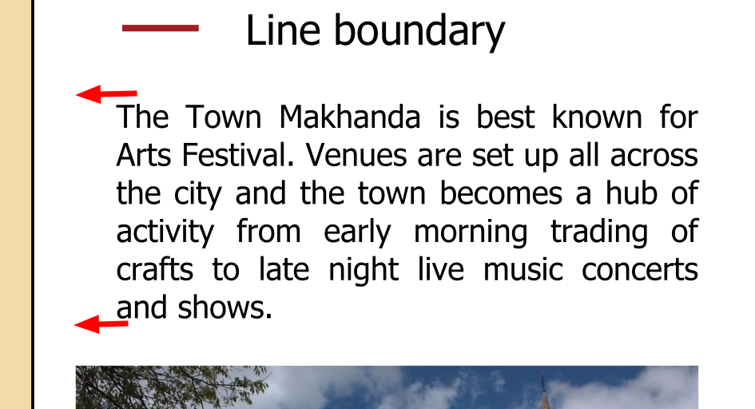
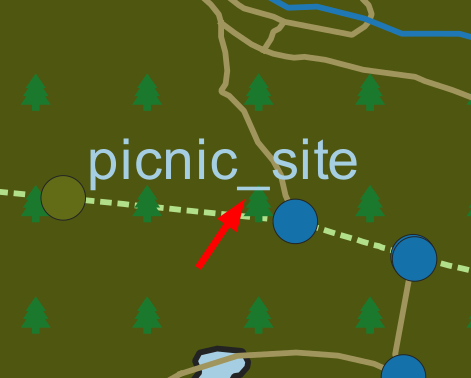

# Cartography Guidelines

This section is a collection of rules and mantras used by Kartoza to Make beautifull and effective catography.

## Tim's three principles

In the above image we can see a framework for you to use to develop your cartography skills. There are three principles you should understand in order to make great cartographic products. The principles are an adaptable construct designed to help you make maps which respect your user's intelligence and surprise, excite and delight them.

1. **Process:** This is definition of a standardised, rigourous set of steps that should be followed by for yourself and / or your co-workers to adhere to when developing your product. Process is the unexciting stuff that happens in the background. Your process should be defined as a nest list of statements. The best way to explain is by an example:
    1. All map fonts should be at least or larger than 6pt.
    2. All map symbols should be at least or larger than 3mm.
    3. All third party map symbols should available published under an open license.
    4. .... etc. ....
The development of the process is to have the creation of your map repeatable from one end to another, and to be able to work collaboratively with colleages in a consistent way.
2. **Technical Skill**: This is the process whereby you learn the capabilities of the software (e.g. QGIS) as thoroughly as possible in order to be able to articulate any idea you or others may have as a cartographic expression. Technical skill is a process of continual learning and acquiring it should commence with the development of a high level framework of the cartographi system and then progress with a deeper and deeper understanding of all of the constituent parts.
3. **Creativity:** This is the hardest (and sometimes impossible) to imbue in a cartographer. When you lack personal creativity to come up with great map designs, you should (ethically) build on the work of others through emulation. By ethically we mean, crediting the inspiration of your designs to the correct person, asking permission when needed, and being sensitive to the livelhood and reputation for whoever you derive your work from. When you do have a creative side, you should be using it to inform the process and learning of technical skills so that you can articulate your vision in the cartography you produces.

We should stress that all rules you or others create can be broken if they are broken with intention. That is to say, if you decide a 3 point font symbol is critical for the artistic or technical vision, you should not be afraid to make such a decision. What we want to avoid is unintentional breaking of your own rules as it will lead to a less professional looking product.

The relative size of your circles for process versus creative versus technical abilities will likely differ widelines. Your job is to strive in your personal journey as a cartographyer to bring them into good proportion and to grow the areas which are under developed. There is a lot of theory out there on cartographic design, but I really recommend reading [this wikipedia page: https://en.wikipedia.org/wiki/Cartographic_design](https://en.wikipedia.org/wiki/Cartographic_design) and also reading the QGIS Map Design book by Anita Graser and Gretchen Peterson ([available at https://locatepress.com/book/qmd2](https://locatepress.com/book/qmd2)). .

## Steps to preparing a map

1. **Choose your locality.** Perhaps you have a client or an assignment which will determine the place. Or perhaps you have the feedom to choose the place yourself.
2. **Choose the scale for your map.** Again this may be client driven based on a specification or you might have the freedom to choose yourself. But decide up front what scale you will view the map at as it will influence all your decisions as you develop your map. In some cases you may be asked to make a variable scale product e.g. for a web map that can be zoomed in and out. If you are producing a variable scale map, determine which scale ranges and intervals will be used. For example, OpenStreetMap defines [standard scale intervals](https://wiki.openstreetmap.org/wiki/Zoom_levels) which are used by many web web mapping toolkits. If you are able to choose your own scale, try to choose a humanistic scale e.g. 1:50 0000, 1:5000 etc.
3. Assuming you are preparing a fixed scale map, **define the extent of your map**. This may be determined by the print page size or by client factors. In some cases, the size of the print medium may influence the scale of your map. For example, you may be printing to an A4 map and need to choose a scale that allows you to see the whole town or area of interest.
4. **Determine which data layers to feature in your map**. Some typical examples will be roads, buildings, rivers, water bodies, points of interest etc. Make a list and then go out and procure your data. For each dataset your find, keep note of the following details in a spreadsheet or notes file:
    1. Date of download
    2. Source (name of person or organisation)
    3. Attribution (citation for the data)
    4. URL
    5. Notes
5. **Determine the purpose of your map.** Every map has a story to tell. Maybe you want to show a tourist around your city? Perhaps it is a narrative about crime or socio-economics. Try to create a short narrative like you were telling a friend about visiting the place in your map to create a sense of 'feel' about the place.
6. **Plan your colour palette.** Overwhelming your reader with many, jarring colours won't help them to interpret your map well, not will it make for an aesthetically pleaseing experience. If you are not good at working with colours, find a photo of a key feature of the area and lift colours out of the image until you have about 8 to 10 colours of different hues and intensities. Or check out one of the many online sites like [coolers.co](https://coolors.co/image-picker)  .
7. **Choose a style.** There are many amazing cartographic styles out there. Do you want something technical? Cartoony? Medieval looking? Find an example of a similar style to what you have in mind and look at what visual elements they use to cartography style.  - Medieval Mappa Mundi map from the 1300s ([source - Wikipedia](https://en.wikipedia.org/wiki/Mappa_mundi#/media/File:Hereford-Karte.jpg))
8. **Plan your layout.** If you are making a print map, it can be useful to roughly plan where all the elements such as map, legend, photos or graphics etc. will appear on your layout. That will influence some decisions in your cartography and will help you to organise your work plan.
9. **Create a set of guidelines.** Create some rules for yourself to follow. Life gets a lot easier when you have a framework to construct your work on than when you are just 'winging it'.
10. Use the **QGIS QuickOSM Plugin** to quickly establish a baseline set of layers for your map. .

## Mantras

1. The user should not be exposed to the inner workings of the system. With is guideline we try to avoid asking the user to perform activities that presume or require that they have inside knowledge of how the system works. Where breaking this guideline is unavoidable, such tasks should be well described so as to allow the user to carry out the task with the least possible friction.
2. If you use somebody else's work, they should be attributed unless they do not require it.
3. Get peer review of your work early and often.
4. Keep to the topic of your creation.
5. Speak to your audience. Think of your work from the user's point of view and create something they can relate to.
6. Follow the principle of separation of concerns. Users should have a clear understanding of where they are in a workflow, being presented with information which is thematic to the task at hand, whilst non-relevant questions or  information should be hidden.
7. Use emphasis sparingly. If everything is emphasised, nothing is emphasised! Some things that provide emphasis are .
8. Layout visual elements in a consistent way in terms of size, colour and spacing. Break this rule with intention. .
9. Tell a story!
10. Make sure the user understands why they are here.
11. Explicit is better than implicit. Don't assume your users know about simple things like north direction etc.
12. Design the system to be easy to maintain. In this case, the map should avoid introducing unneeded functionality, using unneeded infrastructure, include obfuscated or overly complex terms or visual imagery. To achieve this, we should strive for simplicity and clarity in the user experience.
13. Don't present data, present insights.
14. Pay extreme attention to detail to create a professional product.
15. Pay extreme attention to detail to create a professional product.
16. Reduce reduce reduce - prune the content until it has the minumum number of elements needed to convey your message.
17. Make rules for yourself and follow them closely. Break your rules with intention. Create a consistent visual and interactive metaphor and using it throughout the system if possible.
18. "Obey the principle of least surprise". Design to reduce cognative friction.
19. Surpise and delight your user.
20. There is no such thing as cheating, only finding creative solutions to your problems.
21. Whenever possible, do things for the user.
22. There is no such thing as cheating, only finding creative solutions to your problems.

## Choosing a Coordinate Reference System for your map

The order of preference for selection of a CRS for your map should be determined by the intended purpose and by client requirements:

Scale | CRS Type | CRS | Notes
------|----------|-----|--------
Global | Spherical | IAU_2015:39965 | **Orthographic**   Use for inset maps or contextual maps. Create a customised CRS based on this to move the LO origin.
Global | Cylindrical | EPSG:8857 | **Equal Earth**  Use for flat maps of the world. Represents country sizes fairly. See [The Equal Earth Website](https://equal-earth.com/equal-earth-projection.html).
Any | Spherical | EPSG:3857 | **Spherical**  Use for maps destined for the web or that incorporate data from online sources like MapTiler or OSM tiles.
Regional | Conic | EPSG:102024 | **Lambert**  Use for maps covering a large East-West area. For example spanning 3 or 4 UTM zones.
Local | Mercator | EPSG:32XXXX | **UTM**  Use for maps covering small, local areas. For example spanning  1 or less UTM zones.

## Cartography Resources

Name | Description
-----|-------------
[Oxford AI Textures](https://www.robots.ox.ac.uk/~vgg/data/dtd/) | Use for raster fill textures. License unknown.
[QGIS Styles](https://plugins.qgis.org/styles/) | A collection of re-usable QGIS styles you can use to level up your cartography and learn how to produce interesting cartography.
[QGIS Example Projects](https://plugins.qgis.org/geopackages/) | A collection of QGIS projects which provide reference examples of how different GIS workflows in QGIS.
[QGIS Example Processing Models](https://plugins.qgis.org/models/)| A collection of processing models which solve different geospatial analysis problems.
[QGIS Example 3D Models](https://plugins.qgis.org/wavefronts/) | A collection of 3d Objects you can use as point symbol markers for your 3D Scenes.
[QGIS .lyr Files](https://plugins.qgis.org/layerdefinitions)| A collection of QGIS .lyr files with useful datasets that you can add to your QGIS projects.
[Google Fonts](https://github.com/google/fonts/archive/refs/heads/main.zip) | A large collection of fonts you can use in your projects. We also deploy these fonts in OSGS too so if you make a web map they will be available there.
[GNU Fonts](http://ftp.gnu.org/gnu/freefont/freefont-ttf-20120503.zip) | Another large set of free fonts you can use in your project.

## Common issues in cartography

No. | Image | Description
----|-------|------------------------
1 |  | Dont let labels overlap features.
2 |  | Make sure that major roads cover minor roads.
3 |  | Set your canvas scale to the scale you plan to print at 1️⃣ then lock it 2️⃣ then when you zoom in and out with your scroll wheel it will zoom into pixels at the fixed scale 3️⃣.
4 |  | Don't include roads on your map that end abruptly unless this indeed reflects reality.
5 |  | Generally you should use a round cap style for your roads to avoid issues of the road cap extending beyond intersecting roads.
6 |  | As a general rule, points should be drawn above polygon and line features.
7 |  | Use a font that matches the language of your map.
8 |  | Use symbol layers to place a solid background behind symbols which are transparent and are getting lost in the background.
9 |  | Do not use transparency inappropriately. Features like dams should be usually rendered with a solid fill.
10 |  | Avoid visual clutter in your map. If there are too many features visible with similar contrast  your user will quickly become overwhelmed.
11 |  | Avoid overlapping features that don't naturally overlap.
12 |  | Use layer symbol levels for multilayer symbols to prevent elements of the style overlapping.
13 |  | Don't use legend items that are not meaningful.
14 |  | Use call out labels when they risk covering important features on the map.
15 |  | Don't let line or polygon features obscure point symbols.
16 |  | Make sure the sizes of components on your map are balanced.
17 |  | Avoid side effects of using transparent colours.
18 |  | Always run your text through a spelling and grammar checker.
19 |  | Have someone else read your prose to ensure the phrasing is clear and easy to read.
20 |  | Learn how to split legend columns to create a sense of balance in your composition.
21 |  | Don't use light colours on a dark background, dark colours on a dark background.
22 |  | Humanize all text shown to users (see mantra about exposing users to inner workings of the system).
23 |  | Set up your rendering options so that your symbols are not partially drawn / clipped - unless this is by design.
24 |  | Avoid having labels obscure the features they are labelling.
25 |  | Make sure all elements are aligned with pixel perfect precision.
26 |  | Ensure white space between elements is the same to create a sense of perfect symmetry. Using a layout grid can help a lot with this.
27 |  | Avoid repeating labels on the same line segment unless it is by intention.
28 |  | Where relevant, provide context at the edges of your map so the user understands where they will go if they leave the map.
29 |  | Always use CRS that is suitable for the study area. Avoid CRS that distorts your study area.
30 |  | Avoid placing labels such that the callout crosses several other boundaries.
31 |  | Avoid repetition and unnecessary elements such as adding the word 'Legend' to the legend in situations where it is obvious.
30 |  | Avoid using a sequential color scheme when you have many categories since it makes it difficult to distinguish between categories, and use diverging, converging, or other schemes. For example, instead of light red to dark red, use red to blue.
[//]: # (This is a comment it wont be rendered if you leave a blank line after)

[//]: # ( Template row: )

1 |  |

[//]: # ( Template numbers: )

[//]: # ( 0️⃣ 1️⃣ 2️⃣ 3️⃣ 4️⃣ 5️⃣ 6️⃣ 7️⃣ 8️⃣ 9️⃣ 🔟 )
