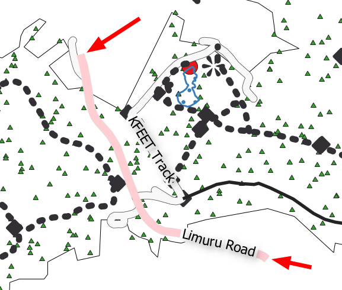
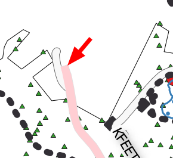
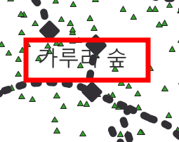

# Cartography Guidelines

This section is a collection of rules and mantras used by Kartoza to Make beautifull and effective catography.

## Steps to preparing a map

1. **Choose your locality.** Perhaps you have a client or an assignment which will determine the place. Or perhaps you have the feedom to choose the place yourself.
2. **Choose the scale for your map.** Again this may be client driven based on a specification or you might have the freedom to choose yourself. But decide up front what scale you will view the map at as it will influence all your decisions as you develop your map. In some cases you may be asked to make a variable scale product e.g. for a web map that can be zoomed in and out. If you are producing a variable scale map, determine which scale ranges and intervals will be used. For example, OpenStreetMap defines [standard scale intervals](https://wiki.openstreetmap.org/wiki/Zoom_levels) which are used by many web web mapping toolkits. If you are able to choose your own scale, try to choose a humanistic scale e.g. 1:50 0000, 1:5000 etc.
3. Assuming you are preparing a fixed scale map, **define the extent of your map**. This may be determined by the print page size or by client factors. In some cases, the size of the print medium may influence the scale of your map. For example, you may be printing to an A4 map and need to choose a scale that allows you to see the whole town or area of interest.
4. **Determine which data layers to feature in your map**. Some typical examples will be roads, buildings, rivers, water bodies, points of interest etc. Make a list and then go out and procure your data. For each dataset your find, keep note of the following details in a spreadsheet or notes file:
    1. Date of download
    2. Source (name of person or organisation)
    3. Attribution (citation for the data)
    4. URL
    5. Notes
5. **Determine the purpose of your map.** Every map has a story to tell. Maybe you want to show a tourist around your city? Perhaps it is a narrative about crime or socio-economics.

## Common issues in cartography

No. | Image | Description
----|-------|------------------------
1 |  | Dont let labels overlap features.
2 |  | Make sure that major roads cover minor roads.
3 |  | Set your canvas scale to the scale you plan to print at 1️⃣ then lock it 2️⃣ then when you zoom in and out with your scroll wheel it will zoom into pixels at the fixed scale 3️⃣.
4 |  | Don't include roads on your map that end abruptly unless this indeed reflects reality.
5 |  | Generally you should use a round cap style for your roads to avoid issues of the road cap extending beyond intersecting roads.
6 |  | As a general rule, points should be drawn above polygon and line features.
7 |  | Use a font that matches the language of your map.
8 |  | Use symbol layers to place a solid background behind symbols which are transparent and are getting lost in the background.
9 |  | Do not use transparency inappropriately. Features like dams should be usually rendered with a solid fill.
10 |  | Avoid visual clutter in your map. If there are too many features visible with similar contrast  your user will quickly become overwhelmed.

[//]: # (This is a comment it wont be rendered if you leave a blank line after)

[//]: # ( Template row: )

1 |  |

[//]: # ( Template numbers: )

[//]: # ( 0️⃣ 1️⃣ 2️⃣ 3️⃣ 4️⃣ 5️⃣ 6️⃣ 7️⃣ 8️⃣ 9️⃣ 🔟 )
