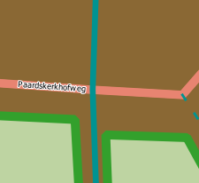

# Cartography Guidelines

This section is a collection of rules and mantras used by Kartoza to make beautiful and effective cartography.

## Tim's three principles

In the above image we can see a framework for you to use to develop your cartography skills. There are three principles you should understand in order to make great cartographic products. The principles are an adaptable construct designed to help you make maps which respect your user's intelligence in order to surprise, excite and delight them.

1. **Process:** This is definition of a standardised, rigorous set of steps that you yourself should follow, along with your co-workers, and adhere to when developing your product. Process is the unexciting stuff that happens in the background. Your process should be defined as a nested list of statements. The best way to explain is by an example:
    1. All map fonts should be at least or larger than 6pt.
    2. All map symbols should be at least or larger than 3mm.
    3. All third party map symbols should be available and published under an open license.
    4. .... etc. ....
The purpose of the development process is to have the creation of your map repeatable from one end to another, and to be able to work collaboratively with colleages and clients in a consistent way.
2. **Technical Skill**: This is the process whereby you learn the capabilities of the software (e.g. QGIS) as thorough as possible in order to be able to articulate any idea you or others may have as a cartographic expression. Technical skill is a process of continual learning and acquiring it should commence with the development of a high level framework of the cartographic system and then progress with a deeper and deeper understanding of all of the constituent parts.
3. **Creativity:** This is the hardest (and sometimes impossible) principle to imbue in a cartographer. When you lack personal creativity to come up with great map designs, you should (ethically) build on the work of others through emulation. By ethically we mean, crediting the inspiration of your designs to the correct person, asking permission when needed, and being sensitive to the livelihood and reputation for whoever you derive your work from. When you do have a creative side, you should be using it to inform the process and learning of technical skills so that you can articulate your vision in the cartography you produce.

We should stress that all rules you or others create can be broken if they are broken with intention. That is to say, if you decide a 3 point font symbol is critical for the artistic or technical vision, you should not be afraid to make such a decision. What we want to avoid is unintentional breaking of your own rules as it will lead to a less professional looking product.

The relative size of your circles for process versus creative versus technical abilities will likely differ widely. Your job is to strive in your personal journey as a cartographer to bring them into good proportion and to grow the areas which are under developed. There is a lot of theory out there on cartographic design, but I really recommend reading [this wikipedia page: https://en.wikipedia.org/wiki/Cartographic_design](https://en.wikipedia.org/wiki/Cartographic_design) and also reading the QGIS Map Design book by Anita Graser and Gretchen Peterson ([available at https://locatepress.com/book/qmd2](https://locatepress.com/book/qmd2)). .

## Cartographic Map Design 

### Reference : [Cartography in Map Design](https://en.wikipedia.org/wiki/Cartographic_design "Cartographic Map Design")

**Definition.** Cartographic design or map design is the process of crafting the appearance of a map, applying the principles of design and knowledge of how maps are used to create a map that has both aesthetic appeal and practical function. It shares this dual goal with almost all forms of design; it also shares with other design, especially graphic design, the three skill sets of artistic talent, scientific reasoning, and technology. As a discipline, it integrates design, geography, and geographic information science.

## Types of Maps

According to the ICSM (Intergovernmental Committee on Surveying and Mapping), there are five different types of maps namely: General Reference, Topographical, Thematic, Navigation Charts and Cadastral Maps and Plans.

## The Cartographic Design Process

As map production and reproduction technology has advanced, the process of designing and producing maps has changed considerably. Most notably, GIS and graphics software not only makes it easier and faster to create a map, but it facilitates a non-linear editing process that is more flexible than in the days of manual cartography. There is still a general procedure that cartographers generally follow:

1. Planning: Typically, this involves answering several questions:

Question | Answer
-------- | ------
What is the purpose of the map? | Maps serve a wide variety of purposes; they may be descriptive (showing the accurate location of geographic features to be used in a variety of ways, like a street map), exploratory (showing the distribution of phenomena and their properties, to look for underlying patterns and processes, like many thematic maps), explanatory (educating the audience about a specific topic), or even rhetorical (trying to convince the audience to believe or do something).
Who is the audience? | Maps will be more useful if they cater to the intended audience. This audience could range from the cartographer herself (desiring to learn about a topic by mapping it), to focused individuals or groups, to the general public. Several characteristics of the audience can aid this process, if they can be determined, such as: their level of knowledge about the subject matter and the region being covered; their skill in map reading and understanding of geographic principles (e.g., do they know what 1:100,000 means?); and their needs, motivations and biases.
Is a map the best solution? | There are times when a map could be made, but a chart, photograph, text, or other tool may better serve the purpose.
What datasets are needed? | The typical map will require data to serve several roles, including information about the primary purpose, as well as supporting background information.
What medium should be used? | Different mapping media, such as posters, brochures, folded maps, page maps, screen displays, and web maps have advantages and disadvantages for different purposes, audiences, and usage contexts.

2. Data Collection: In the era of Geographic information systems, it seems like vast amounts of data are available for every conceivable topic, but they must be found and obtained. Frequently, available datasets are not perfect matches for the needs of the project at hand, and must be augmented or edited. Also, it is still common for there to be no available data on the specific topic, requiring the cartographer to create them, or derive them from existing data using GIS tools.

3. Design and Implementation: This step involves making decisions about all of the aspects of map design, as listed below, and implementing them using computer software. In the manual drafting era, this was a very linear process of careful decision making, in which some aspects needed to be implemented before others (often, projection first). However, current GIS and graphics software enables interactive editing of all of these aspects interchangeably, leading to a non-linear, iterative process of experimentation, evaluation, and refinement.

4. Production and Distribution: The last step is to produce the map in the chosen medium, and distribute it to the audience. This could be as simple as a desktop printer, or sending it to a press, or developing an interactive Web Mapping Site.

## Design Goals

While maps serve a variety of purposes, and come in a variety of styles, most designs share common goals. Some of the most commonly stated include:

Goal | Description
---- | -----------
*Accuracy,* | the degree to which the information on the map corresponds to the nature of the real world. Traditionally, this was the primary determinant of quality cartography. It is now accepted, due largely to studies in Critical Cartography, that no dataset or map is a perfect reproduction of reality, and that the subjective biases and motivations of the cartographer are virtually impossible to circumvent. That said, maps can still be crafted to be as accurate as possible, honest about their shortcomings, and leverage their subjectivity.
*Functionality,* | the usefulness of the map to achieve its purpose. During much of the latter 20th century, this was the primary goal of academic cartography, especially the Cartographic Communication school of thought: to determine how to make the most efficient maps as conduits of information.
*Clarity,* | the degree to which the map makes its purpose obvious and its information easy to access. Clarity can be achieved through removing all but the most important information, but this comes at the expense of other goals.
*Richness,* | the volume and diversity of information the reader can glean from the map. Even maps with a narrowly-defined purpose often require the reader to see patterns in large amounts of data.
*Aesthetic appeal,* | a positive emotional reaction to the overall appearance of the map. Maps may be appreciated as "beautiful," but other positive affects include "interesting," "engaging," "convincing," and "motivating." Aesthetic reactions can be negative as well, such as "ugly," "cluttered," "confusing," "complicated," "annoying," or "off-putting."

These goals often seem to be in conflict, and it may be tempting to prioritize one over the others. However, quality design in cartography, as in any other design field, is about finding creative and innovative solutions to achieve multiple goals. According to Edward Tufte,

> What is to be sought in designs for the display of information is the clear portrayal of complexity. Not the complication of the simple; rather the task of the designer is to give visual access to the subtle and the difficult--that is, the revelation of the complex.

In fact, good design can produce synergistic results. Even aesthetics can have practical value: potential map users are more likely to pick up, and more likely to spend time with, a beautiful map than one that is difficult to look at. In turn, the practical value of maps has gained aesthetic appeal, favoring those that exude a feeling of being "professional," "authoritative," "well-crafted," "clear," or "informative." In 1942, cartographer John K. Wright said,

> An ugly map, with crude colors, careless line work, and disagreeable, poorly arranged lettering may be intrinsically as accurate as a beautiful map, but it is less likely to inspire confidence.

Rudolf Arnheim, an art theorist, said this about the relationship between maps and aesthetics in 1976:

> The aesthetic or artistic qualities of maps are sometimes thought to be simply matters of so-called good taste, of harmonious color schemes and sensory appeal. In my opinion, those are secondary concerns. The principal task of the artist, be he a painter or a map designer, consists of translating the relevant aspects of the message into the expressive qualities of the medium in such a way that the information comes across as a direct impact of perceptual forces. This distinguishes the mere transmission of facts from the arousal of meaningful experience.

More recently, cartographers have recognised the central role of aesthetics in cartographic design and called for greater focus on how this role functions over time and space. For example, in 2005, Dr Alex Kent (former President of the British Cartographic Society) recommended:

> It will thus be more useful to cartographers and the development of cartography in general to undertake further research towards understanding the role of aesthetics in cartography than to pursue universal principles. Some possible topics for investigation include:
>> 1. A history of the development of aesthetics in cartography;
>> 2. An exploration of geographical variations in cartographic aesthetics; and
>> 3. A critical examination of the factors influencing aesthetic decisions in contemporary mapmaking. 

## Steps to preparing a map

1. **Choose your locality.** Perhaps you have a client or an assignment which will determine the place. Or perhaps you have the freedom to choose the place yourself.
2. **Choose the scale for your map.** Again this may be client driven based on a specification or you might have the freedom to choose yourself. But decide upfront what scale you will view the map at as it will influence all your decisions as you develop your map. In some cases you may be asked to make a variable scale product e.g. for a web map that can be zoomed in and out. If you are producing a variable scale map, determine which scale ranges and intervals will be used. For example, OpenStreetMap defines [standard scale intervals](https://wiki.openstreetmap.org/wiki/Zoom_levels) which are used by many web mapping toolkits. If you are able to choose your own scale, try to choose a humanistic scale e.g. 1:500000, 1:5000 etc.
3. Assuming you are preparing a fixed scale map, **define the extent of your map**. This may be determined by the print page size or by client factors. In some cases, the size of the print medium may influence the scale of your map. For example, you may be printing to an A4 map and need to choose a scale that allows you to see the whole town or area of interest.
4. **Determine which data layers to feature in your map**. Some typical examples will be roads, buildings, rivers, water bodies, points of interest etc. Make a list and then go out and procure your data. For each dataset your find, keep note of the following details in a spreadsheet or notes file:
    1. Date of download
    2. Source (name of person or organisation)
    3. Attribution (citation for the data)
    4. URL
    5. Notes
5. **Determine the purpose of your map.** Every map has a story to tell. Maybe you want to show a tourist around your city? Perhaps it is a narrative about crime or socio-economics. Try to create a short narrative like you were telling a friend about visiting the place in your map to create a sense of 'feel' about the place.
6. **Plan your colour palette.** Overwhelming your reader with many, jarring colours won't help them to interpret your map well, nor will it make for an aesthetically pleasing experience. If you are not good at working with colours, find a photo of a key feature of the area and lift colours out of the image until you have about 8 to 10 colours of different hues and intensities. Or check out one of the many online sites like [coolors.co](https://coolors.co/image-picker)  .
7. **Choose a style.** There are many amazing cartographic styles out there. Do you want something technical? Cartoony? Medieval looking? Find an example of a similar style to what you have in mind and look at what visual elements they use to cartography style.  - Medieval Mappa Mundi map from the 1300s ([source - Wikipedia](https://en.wikipedia.org/wiki/Mappa_mundi#/media/File:Hereford-Karte.jpg))
8. **Plan your layout.** If you are making a print map, it can be useful to roughly plan where all the elements such as map, legend, photos or graphics e.t.c. will appear on your layout. That will influence some decisions in your cartography and will help you to organise your work plan.
9. **Create a set of guidelines.** Create some rules for yourself to follow. Life gets a lot easier when you have a framework to construct your work on than when you are just 'winging it'.
10. Use the **QGIS QuickOSM Plugin** to quickly establish a baseline set of layers for your map. .

## Map Layout

A typical map, whether on paper or on a web page, consists of not only the map image, but also other elements that support the map:

> A **title** tells the reader what the map is about, including the purpose or theme, and perhaps the region covered.
> A **legend** or **key** explains the meaning of the symbols on the map
> A **neatline** may frame the entire map image, although many maps use negative space to set the map apart
> A **compass rose** or **north arrow** provides orientation
> **Inset maps** may serve several purposes, such as showing the context of the main map in a larger area, showing more detail for a subset of the main map, showing a separated but related area, or showing related themes for the same region.
> A **bar scale** or other indication of scale translates between map measurements and real distances.
> **Illustrations** may be included to help explain the map subject or add aesthetic appeal.
> **Explanatory text** may discuss the subject further
> **Metadata** declares the sources, date, authorship, projection, or other information about the construction of the map.

Composing and arranging all of the elements on the page involves just as much design skill and knowledge of how readers will use the map as designing the map image itself. Page composition serves several purposes, including directing the reader's attention, establishing a particular aesthetic feel, clearly stating the purpose of the map, and making the map easier to understand and use. Therefore, Page layout follows many of the same principles of Composition above, including figure-ground and Visual hierarchy, as well as aesthetic principles adopted from Graphic design, such as balance and the use of White space (visual arts). In fact, this aspect of cartographic design has more in common with graphic design than any other part of the craft.

## Mantras

1. The user should not be exposed to the inner workings of the system. Which is guideline we try to avoid asking the user to perform activities that presume or require that they have inside knowledge of how the system works. Where breaking this guideline is unavoidable, such tasks should be well described so as to allow the user to carry out the task with the least possible friction.
2. If you use somebody else's work, they should be attributed unless they do not require it.
3. Get peer review of your work early and often.
4. Keep to the topic of your creation.
5. Speak to your audience. Think of your work from the user's point of view and create something they can relate to.
6. Follow the principle of separation of concerns. Users should have a clear understanding of where they are in a workflow, being presented with information which is thematic to the task at hand, whilst non-relevant questions or information should be hidden.
7. Use emphasis sparingly. If everything is emphasised, nothing is emphasised! Some things that provide emphasis are .
8. Layout visual elements in a consistent way in terms of size, colour and spacing. Break this rule with intention. .
9. Tell a story!
10. Make sure the user understands why they are here.
11. Explicit is better than implicit. Don't assume your users know about simple things like north direction etc.
12. Design the system to be easy to maintain. In this case, the map should avoid introducing unneeded functionality, using unneeded infrastructure, include obfuscated or overly complex terms or visual imagery. To achieve this, we should strive for simplicity and clarity in the user experience.
13. Don't present data, present insights.
14. Pay extreme attention to detail to create a professional product.
15. Reduce reduce reduce - prune the content until it has the minimum number of elements needed to convey your message.
16. Make rules for yourself and follow them closely. Break your rules with intention. Create a consistent visual and interactive metaphor and using it throughout the system if possible.
17. "Obey the principle of least surprise". Design to reduce cognitive friction.
18. Surpise and delight your user.
19. There is no such thing as cheating, only finding creative solutions to your problems.
20. Whenever possible, do things for the user.
21. Do not ever underestimate your capabilities to overcome any problem; if there is a will, there surely is a way! (credit: Namrata Karki)

## Choosing a Coordinate Reference System for your map

The order of preference for selection of a CRS for your map should be determined by the intended purpose and by client requirements:

Scale | CRS Type | CRS | Notes
------|----------|-----|--------
Global | Spherical | IAU_2015:39965 | **Orthographic**   Use for inset maps or contextual maps. Create a customised CRS based on this to move the LO origin.
Global | Cylindrical | EPSG:8857 | **Equal Earth**  Use for flat maps of the world. Represents country sizes fairly. See [The Equal Earth Website](https://equal-earth.com/equal-earth-projection.html).
Any | Spherical | EPSG:3857 | **Spherical**  Use for maps destined for the web or that incorporate data from online sources like MapTiler or OSM tiles.
Regional | Conic | EPSG:102024 | **Lambert**  Use for maps covering a large East-West area. For example spanning 3 or 4 UTM zones.
Local | Mercator | EPSG:32XXXX | **UTM**  Use for maps covering small, local areas. For example spanning  1 or less UTM zones.

## Cartography Resources

Name | Description
-----|-------------
[Oxford AI Textures](https://www.robots.ox.ac.uk/~vgg/data/dtd/) | Use for raster fill textures. License unknown.
[QGIS Styles](https://plugins.qgis.org/styles/) | A collection of re-usable QGIS styles you can use to level up your cartography and learn how to produce interesting cartography.
[QGIS Example Projects](https://plugins.qgis.org/geopackages/) | A collection of QGIS projects which provide reference examples of a number of different GIS workflows in QGIS.
[QGIS Example Processing Models](https://plugins.qgis.org/models/)| A collection of processing models which solve different geospatial analysis problems.
[QGIS Example 3D Models](https://plugins.qgis.org/wavefronts/) | A collection of 3d Objects you can use as point symbol markers for your 3D Scenes.
[QGIS .lyr Files](https://plugins.qgis.org/layerdefinitions)| A collection of QGIS .lyr files with useful datasets that you can add to your QGIS projects.
[Google Fonts](https://github.com/google/fonts/archive/refs/heads/main.zip) | A large collection of fonts you can use in your projects. We also deploy these fonts in OSGS too so if you make a web map they will be available there.
[GNU Fonts](http://ftp.gnu.org/gnu/freefont/freefont-ttf-20120503.zip) | Another large set of free fonts you can use in your project.

## Common issues in cartography

No. | Before | Description | After | 
----|-------|------------------------ |-------
1 |  | Don't let labels overlap features. | 
2 |  | Make sure that major roads cover minor roads. | 
3 |  | 1️⃣ Set your canvas scale to the scale you plan to print at and 2️⃣ lock it. When you 3️⃣ zoom in and out with your scroll wheel it will zoom into pixels at the fixed scale. | 
4 |  | Don't include roads on your map that end abruptly unless this indeed reflects reality. |  
5 |  | Generally, you should use a round cap style for your roads to avoid issues of the road cap extending beyond intersecting roads. | 
6 |  | As a general rule, points should be drawn above polygon and line features. | 
7 |  | Use text that matches the language of your map. | 
8 |  | Use symbol layers to place a solid background behind your symbols if they are transparent and are getting lost in the background of your map. Alternatively, make sure your symbols are darker than your background colours to make sure they are visible and not obstructed. | 
9 |  | Do not use transparency inappropriately. Features like rivers should usually be rendered with a solid fill. |  
10 |  | Avoid visual clutter on your map. If there are too many features visible with similar contrast your user will quickly become overwhelmed. |  
11 |  | Avoid overlapping features that don't naturally overlap. | 
12 |  | Use layer symbol levels for multilayer symbols to prevent elements of the style from overlapping. | 
13 |  | Don't use legend items that are not meaningful. Make sure that your spelling is correct and that there are no underscores or dashes in your legend items. | 
14 |  | Use call-out labels when they risk covering important features on the map. | 
15 |  | Don't let line or polygon features obscure point symbols. | 
16 |  | Make sure your north arrow is linked to your map and is correctly positioned and sized, and is also fully visible. | 
17 |  | Avoid the side effects of using transparent colours. | 
18 |  | Always run your text through a spelling and grammar checker. Make sure the font you choose to use is also readable.|  
19 |  | Have someone else read your prose to ensure the phrasing is clear and easy to read. | 
20 |  | Learn how to split legend columns and edit the symbol sizes to create a sense of balance in your composition. | 
21 |  | Don't use light colours on a light background or dark colours on a dark background. Try to keep your background colours light enough so that all of the features you want to show can be as visible as possible. You want those features to be what your eyes are drawn towards.   | 
22 |  | Humanize all text shown to users (see mantra about exposing users to the inner workings of the system). | 
23 |  | Set up your rendering options so that your symbols are not partially drawn/clipped - unless this is by design. |  
24 |  | Make sure the sizes of the elements in your map layout are balanced. Ensure that the important elements stand out more than the less important elements. Make sure your elements don't overlap unless it's intentional.  |
25 |  | Make sure all elements are aligned with pixel perfect precision.  |  
26 |  | Ensure the white space between elements is the same to create a sense of perfect symmetry. Using a layout grid can help a lot with this. | 
27 |  | Avoid repeating labels on the same line segment unless it is by intention. |  
28 |  | Where relevant, provide context at the edges of your map so the user understands where they will go if they leave the map or provide an inset map so users can orientate themselves within your map. | 
29 |  | Make sure that all of your labels are legible and the colours are contrasting enough not to blend into the rest of your map. Make sure your labels also have the correct orientation. Road labels should go along the road. | 
30 |  | Make sure your symbols are consistent unless intentionally not consistent. Look at the size, colour and transparency of the symbols. | 
31 |  | When choosing colours for your map, and even your layout, first consider what the purpose of your map is and who is going to be looking at it. Does your map need to cater for colour-blind viewers or viewers with other visual impairments? What data are you representing? Are there colours associated with the data? Does your client have a style guide representing the colours they use? Consider all of these factors when styling your data as well as when you design your map layout. | 
32 |  | Be careful when adding defined outlines to your data while styling. Make sure the stroke width is not too thick or that the colour is not too pronounced. You can often get away with not having a defined stroke on your features, depending on the feature. | 
33 |  | Always use CRS that is suitable for the study area. Avoid CRS that distorts your study area.
34 |  | Avoid placing labels such that the callout crosses several other boundaries.
35 |  | Avoid repetition and unnecessary elements such as adding the word 'Legend' to the legend in situations where it is obvious.
36 |  | Avoid using a sequential color scheme when you have many categories since it makes it difficult to distinguish between categories, and use diverging, converging, or other schemes. For example, instead of light red to dark red, use red to blue.

[//]: # (This is a comment it wont be rendered if you leave a blank line after)

[//]: # ( Template row: )

<!-- 1 |  | -->

[//]: # ( Template numbers: )

[//]: # ( 0️⃣ 1️⃣ 2️⃣ 3️⃣ 4️⃣ 5️⃣ 6️⃣ 7️⃣ 8️⃣ 9️⃣ 🔟 )
