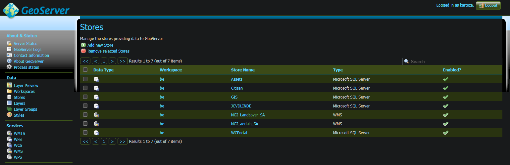

# National Geospatial Intitute data

National Geospatial Institute (NGI)

## NGI portal

The **National Geospatial Institute** of South Africa has a portal available which can be used to obtain South African remotely sensed data. The data is freely available and can be accessed from here: http://www.cdngiportal.co.za/cdngiportal/.

The catalog provides a lot of data and functionality, but for now this quick guide is to show a user can get access to the Aerial photography in QGIS and Geoserver.

## Aerial photographs

- Click on the **Browse ERDAS APOLLO Catalog** tab to the left

- The Aerial imagery can be found at ROOT -> IMAGERY -> ORTHO_RECTIFIED -> WGS84 -> MOSAIC -> DIGITAL
- Two folders are available:
  - **10K_TIF**: This stores individual block tiles (e.g. 3319AA, 3319AB, etc.)
  - **MOSAICS**: Here a user can find the mosaicked rasters for South Africa. 50cm covers the entire SA, whereas 25cm only covers some provinces/areas

- Click on the **MOSAICS** folder
- This should show the following on the catalog:

- Note that each dataset has a WMS link. This link can be used to add the data QGIS or Geoserver, or any other software which supports WMS

### QGIS

Short section on how to add the 50cm Aerials mosaic to QGIS.

#### 50cm Mosaic

- In QGIS, go to **Layer** -> **Data Source Manager**
- Click on the **WMS/WMTS** tab

- Click **New** to add a new connection
- Provide a desired **Name**
- Here is the URL for the 50cm SA mosaic: http://apollo.cdngiportal.co.za/ApolloCatalogWMSPublic/service.svc/get?version=1.3.0&layers=RSA_MOSAIC_50CM_201612
- Authentication should be set to **No Authentication** (data is freely available!)

- Click **OK**
- Click **Connect**
- After the connection succeeded, the user should see something similar to the following:

- Click **Add**. This will add the layer to the QGIS canvas

#### 50cm tiles

Individual tiles can also be added (e.g. 3319AA). This is especially useful if a user wants to focus on a particular area of interest.

- The Aerial tiles can be found at ROOT -> IMAGERY -> ORTHO_RECTIFIED -> WGS84 -> MOSAIC -> DIGITAL -> 10K_TIF
- Select the folder with the desired tileset
  - The user can select an entire tileset (e.g. 3319), or a subset (e.g. 3319AA)
- Copy the WMS link as in the previous section. In this case 3319 will be used as an example: http://apollo.cdngiportal.co.za/ApolloCatalogWMSPublic/service.svc/get?service=WMS&version=1.3.0&REQUEST=GetLayer&layers=3319_2
- Add the data to the canvas
- This would only now cover the selected tileset

### Geoserver

Data from the NGI catalog can also be added to Geoserver as a store.

- In the left panel, click on **Stores**
- Click **Add new Store**

- Select **WMS**. Its at the bottom, under the **Other Data Sources** section
- Set the parameters as follows:
  - **WMS Source Name**: As desired
  - **Description** is optional
  - **Enabled** to selected
  - **Capabilities URL**: http://apollo.cdngiportal.co.za/ApolloCatalogWMSPublic/service.svc/get?service=WMS&version=1.3.0&REQUEST=GetLayer&layers=RSA_MOSAIC_50CM_201612
  - **User Name** and **Password** should be left empty, as the data is freely available
  - Leave the remaining parameters on default

- Click **Save**
- Click on **Layers** on the left pane
- Click **Add a new layer**
- Select the store that's been added for the NGI data
- Select the **RSA_MOSAIC_50CM_201612** layer and publish it

The Geoserver will now have the 50cm Aerial mosaic available for South Africa. As with QGIS, this can also be done only for certain tileset (e.g. 3319) if desired.
