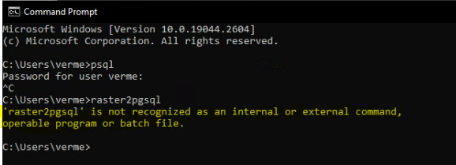
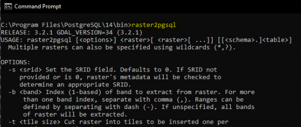

# PostgreSQL issues a user may encounter

## Console commands not working

Sometimes the user may encounter issues with the commands not working in the console. Here is an example:

This can easily be resolved by opening the console in the folder which contains the Postgres console commands:
- Go to the installation folder of the Postgres you want to work with (e.g. “C:\Program Files\PostgreSQL\14\”). Be sure to go to the correct version
- Open the “bin” folder
- The user will note that this folder contains a long list of executables. These executables are what we want to call from the console
- Open the console in this folder
- The user can now run the commands they desire from here

Here is an example of the raster2pgsql command called from within the folder

> Take note that this workaround will also be useful when a server has multiple versions of Postgres installed.
