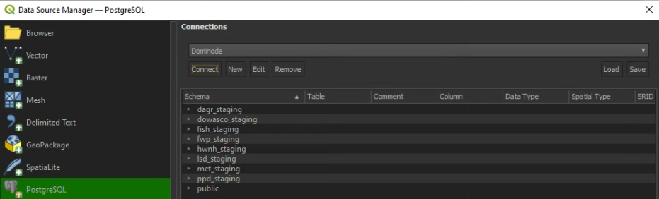
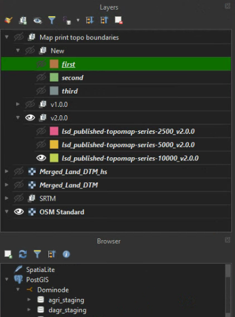

# Guidelines when working with PostgreSQL, PostGIS, and QGIS

This guide deals with restoration of a database (DB) which contains spatial data. In such cases the
DB will be making use of the PostGIS extension.

## Database restoration

This section deals with the restoration for a DB from a dump into a newly created postgres database.

### Create a new database

This section deals with creating a new DB using pgAdmin, with focus on PostGIS. PostGIS allows
the integration of spatial data (data which contains geometries), such as vector data and raster,
into a Postgres DB. If the DB into which the restoration will be done already exists, this step can be skipped.

- Right-click on **Databases**, select **Create**, and then click on **Database**

- In the Create-Database dialog, name the database as desired

> Be sure to use this name performing the restoration step as the target database.

- Select the desired user as the **Owner**. If the user does not exist, have a look at the **User list** section

- Click **Save**
- The DB will now be created
- The user now need to add the extensions for PostGIS and PostGIS raster
- Right-click on **Extensions**, select **Create** and click on **Extension**

- Under **Name** type "postgis"
- Select *postgis*
- Click Save
- If the user will also be importing rasters to the DB, the following needs to be done:
  - Right-click on **Extensions**, select **Create** and click on **Extension**
  - Under **Name** type "postgis_raster"
  - Select the *postgis_raster* extension
  - Click **Save**
- 
> In newer versions of PostGIS this might not be required, as PostGIS already includes the raster extension

- The end result should be similar to the following:

### User list

When restoring a DB dump all users needs to be added/created. This is required because the 
restoration process will fail if the user is not present. This section can be skipped if the
users are already present on the server.

- Open **pgAdmin**
- Right-click **Login/Group Roles**, select **Create**, and then click on **Login/Group Role**
- Provide a **Name**
- Click on the **Privileges** tab
- Set *Can login*, *Superuser*, *Create roles*, *Create databases* and *Inherit rights from the parent roles* as desired
- Click **Save**

- The new user will now be created
- This can be a tedious process, especially if there are a lot of users to add

If you are unsure on what users are required: An error will occur when attempting to perform
the restore, pointing out that the missing user is the cause. This user can then be added.

Best practice will be to provide the correct privileges for each user, but if you are unsure
what the privileges need to be, set all to active. Only do this if you are sure the database
is secure (e.g. only you will have access). Otherwise, avoid doing this.

### Restoring the database dump

Once the above requirements has been met, the user can get to restoring the DB. The terminal/console will be made
use of to perform the restoration.

- Open the terminal/console
- Change the directory to the folder which contains the DB dump

- Run the *pg_restore* command in the terminal: “pg_restore -h localhost -p 5432 -U postgres -d my_new_database my_old_database.dump”
  - **-h**: Host on the network, localhost in this case. If the DB is on a different computer on the network, use the IP of that computer
  - **-p**: Port number, usually 5432 for Postgres. Make sure what port number your postgres is using
  - **-U**: Use the “postgres” username. The user might differ for your server
  - **my_new_database**: The name of the database in the server, “dominode_production” in this case
  - **my_old_database**: The DB dump file to restore.
- Press **Enter** to run the command
- When asked for a password, provide the password in the service file

> If the user experiences an error stating a user is not available/missing, add the user as described in the previous section.

- Once the restoration shows succeeded in the terminal, open **pgAdmin**;
- Refresh the DB into which the restoration were performed;
- Open it, and under *Schemas*, the user should see something similar to the following:

> Take note that the imported tables might be stored in the public schema and the DB does not contain additional schemas

Possible issues a users can encounter when restoring a DB:
Restoration can fail for numerous reasons, and can be difficult to resolve. Here are some tips on solving possible issues:
- Authentication issues:
  - Be sure you are using the correct password associated with the correct user;
  - If you are using the "postgres" user, the password will likely be the same as the password being used when opening pgAdmin4;
  - If you are using user ‘x’ (the owner of the DB), be sure that you are using the password saved in the service file (Postgres Service file section); or
  - Be sure that the service file has been set up correctly, especially the environmental variable, as this can also cause authentication issues.
- User role error:
  - If a user cannot be found when performing a DB restore, just add the username referred to in the console as explained in the User list section.

## Importing spatial data into a database

### Raster importing

This section will deal with importing of rasters into a Postgres DB. As with other spatial data, the PostGIS extension
needs to be installed for the DB. Also, this step can only be done using console commands. There are a lot of resources
on how to use this command, but here is a short overview: https://spatial-dev.guru/2022/01/28/import-rasters-file-to-postgis-database-using-raster2pgsql/.
Also be sure that the PostGIS raster extension has been added to the DB.

The user first needs to get some information on the raster before getting started.
- Open the raster in QGIS
- Right-click on the raster in the layer list, and select **Properties**

- Click on the **Source** tab
- The user needs to make a note of the Coordinate reference system (CRS). The importing requires the EPSG number. In this example its "32620"

- If the user desires tiling on the raster when doing the import, click on the **Information** tab
- Make note of the Width and Height of the raster

> These width and height values are the number of pixels.
> If the raster has a large number of pixels, it is recommended to make use of tiling when importing the raster.
> For a small raster, tiling will not be required

- Close the **Layer Properties** dialog

Importing the raster will be done using the *raster2pgsql* command

- Open the terminal/console
- Run the following command: "raster2pgsql -s 32620 -F -I -C directory-to-raster Schema.Table name | psql -h localhost -p 5432 -U Username database-name"
  - -s: This is CRS;
  - -F: Creates a filename column;
  - -I: Raster spatial index, which will optimize raster processing; and
  - -t: (optional) Raster tile size (e.g. 2500x2500).
  - directory-to-raster: Directory to the raster
  - Schema: public, or any other desired schema
  - Table name: ‘elevation’, or any name the user desires
  - Username: Likely ‘postgres’, but might differ depending on the user’s postgres
  - database-name: Name of the database
- If the user gets memory errors while performing the raster import, not using tiling is likely the culprit

- Do the following if you encounter such an error, otherwise this can be skipped:
  - Make use of tiling
  - -t: '2500x2500'
  - This should suffice for most cases
  - The user can make use of a tiling size which they feel will better fit their scenario
  - Each tile will have a row in the imported raster table
- The importing might run a will, depending on the raster spatial resolution and number of pixels
- During importing the user should see something similar to the following:

- Each of those inserts is a new tile being added to the table
- Once the processing is done, the user should see something similar to the following:

How to check if the raster imported successfully:
- Open pgAdmin
- Go to the DB, schema, and right-click on the schema which should contain the raster. Click **Refresh**
- The table, which contains the raster tiles, should be there:

## Connect to Postgres database in QGIS

This section provides details on how to make a connection to a Postgres DB from within QGIS.

- Open **QGISv
- Click on the **Layer** menu, and select **Data Source Manager**

- Click on the **PostgreSQL** tab
- Click on the **New** button

- Provide the following information:
  - **Name**: This can be what the user desire (e.g. “Dominode”)
  - **Service**: Leave empty
  - **Host**: localhost (or the IP of the computer hosting the server)
  - **Port**: 5432 (or the port number the user’s server makes use of)
  - **Database**: dominode_production
  - **User name**: postgres
  - **Password**: The password used when the user opens pgAdmin4
  - Enable **Store** for the username and password if the user desired to save the authentication
  - Enable **Also list tables with no geometry**
  - Enable **Allow saving/loading QGIS projects in the database**
- Click **Test Connection**
- The user should see *Connection to database was successful* if there were no problems connecting to the DB

- Click **OK**
- On the **Connection** dialog, click **Connect**. The user should see the DB schemas as shown below

- Click **Close**

## Load layers from a database

Once the user has established a connection the DB in QGIS, they can start loading data.
- In QGIS, go to the **Browser** dialog. It should be below the **Layers** dialog
- Click on **PostGIS** and then on database name (‘Dominode’ in this example)
- The user will now see the list of DB Schemas

- Open the *Schema* where the data is stored, "public" in this example
- Right-click on the layer, and click on **Add Layer to Project**

> The user can also drag-and-drop the layer to accomplish the same result.

- The layer will now be added to the QGIS canvas

## QGIS project stored in a database

Postgres allows the storage of QGIS projects, which can be opened directly in QGIS from the DB.

> Be sure that you selected the **Allow saving/loading QGIS projects in the database** when making the connection to the DB.

- In QGIS, go to the Browser (likely below the Layers section)
- Click on the PostGIS drop-down, and open the database the user desires (Dominode in this case);
- Open the Schema which contains the QGIS project (lsd_staging in this case);

- Double-click on the project to open it

> If QGIS crashes when attempting to open the project, it might be a versioning issue (e.g. an older version were used to store the project in the DB).
