# QGIS Atlas

## View topographic maps
This section deals with viewing/opening the Atlas layouts.
- In the QGIS project, go to the Project menu, and Layouts
- All Topographic map options are available there, as can be seen here:

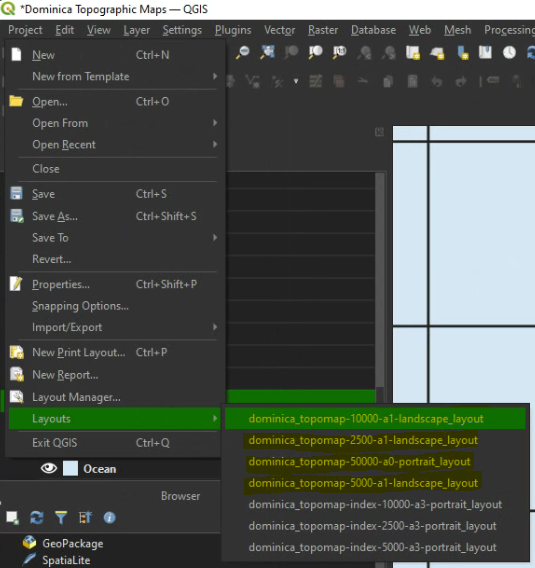

- Click on the layout you want to open
- The user will see a window similar to the following:

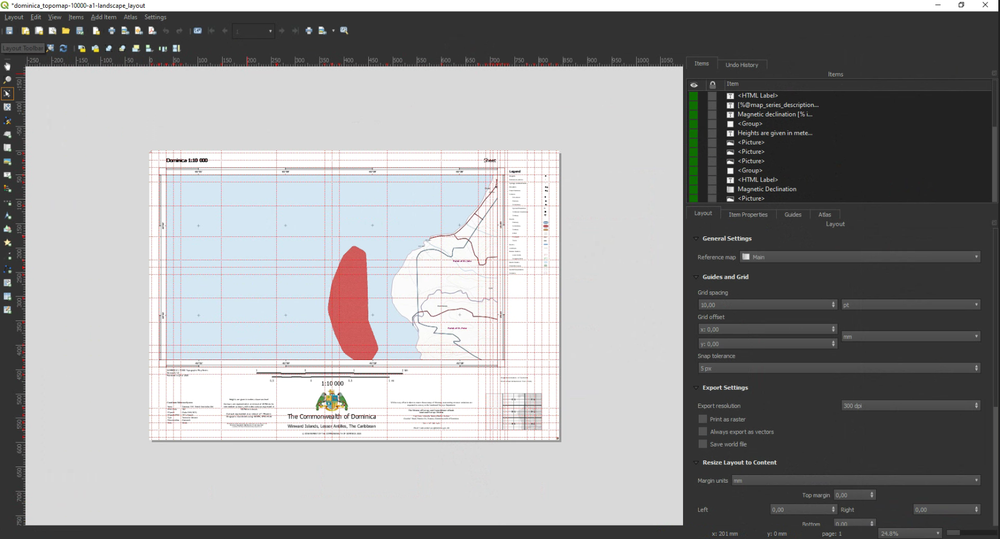

- Click on the **Preview Atlas** button. This will allow the user to have a look at the available topographic maps for this layout

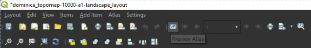

- The user can now use the arrows to traverse through all the maps, or use the drop-down list to select a particular map

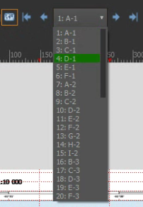

A tile will automatically update when a user selects it.

## Export topographic maps

A QGIS Atlas user can export a single tile, or batch export tiles. The first
section deals with single exports, this is followed by a section on batch exporting.

### Single export

- Click on the **Layout** tab;
- Have a look at the **Export Settings** group
- Set the **Export resolution** (dpi)

> Setting this value too high might result in QGIS taking very long to export the maps! So if you have exporting problems, lower this value.

- Activate **Print as raster**, as we will be exporting as PDF
- (Optional) Activate Save world file if desired
- Click on the **Preview Atlas** button

- Select the tile you want to export

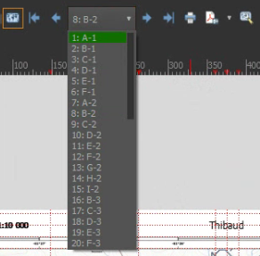

- Click on the **Export as PDF** button

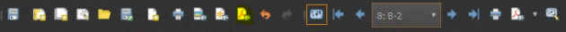

- The **Export to PDF** dialog will now be open
- Provide your desired output name, or use the default output name
- Click **Save**

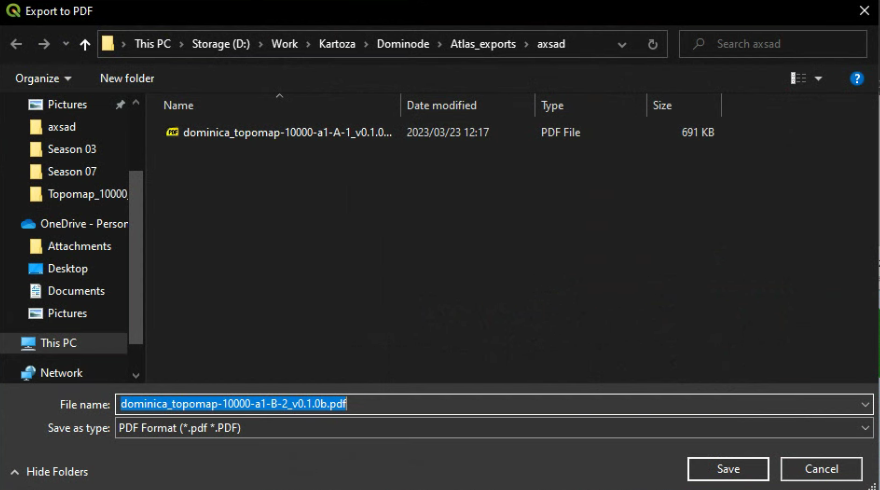

- The PDF Export Options dialog will open;
- Set options as desired, but default options should suffice
- Click Save

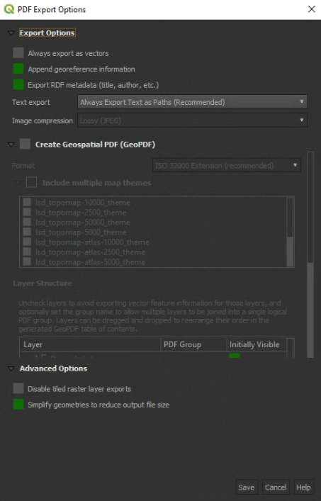

- It might take a few minutes, depending on the DPI you are using

### Batch export

- Click on the **Layout** tab;
- Have a look at the **Export Settings** group
- Set the **Export resolution** (dpi)

> Setting this value too high might result in QGIS taking very long to export the maps! So if you have exporting problems, lower this value.

- Activate **Print as raster**, as we will be exporting as PDF
- (Optional) Activate Save world file if desired
- Click on the **Export** drop-down menu
- Select **Export Atlas as PDF**

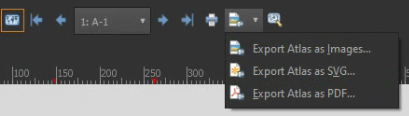

- Select your desired output folder
- The **PDF Export Options** dialog will appear
- Options can be left as default here, or change as desired

- Click **Save**;
- The exporting will start running, this can take very long, even on a fast computer. Exporting speed depends on the following:
  - Number of topographic maps, which will differ depending on scale
  - The higher the DPI, the longer this will take

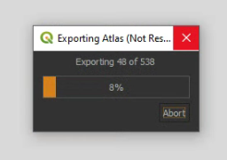

- QGIS might seem like its stalling, just leave it running

Here is an example of a PDF topographic map:

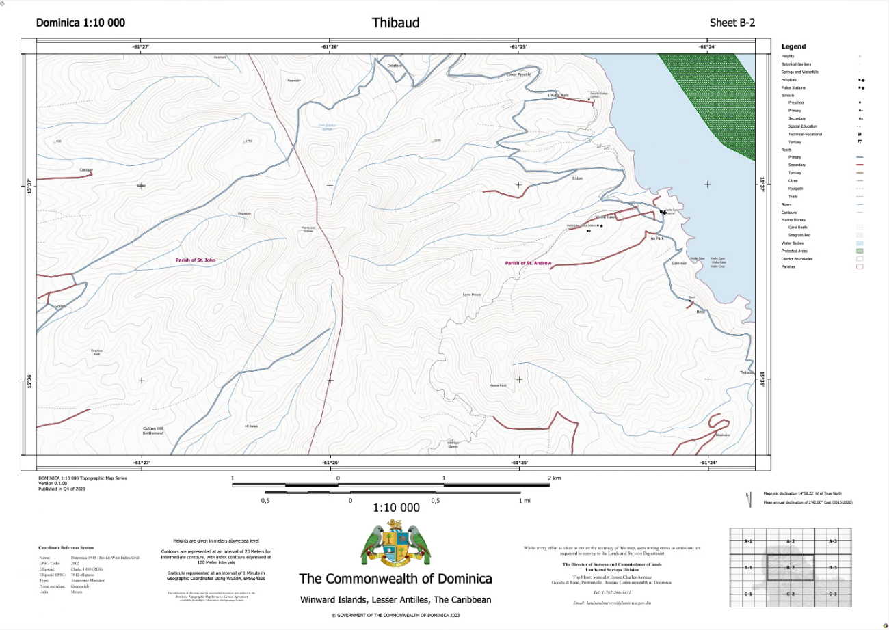
