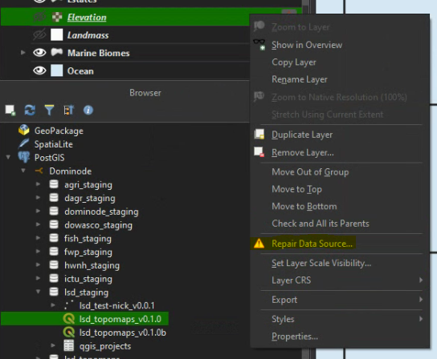
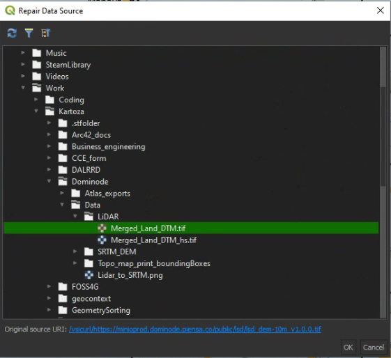
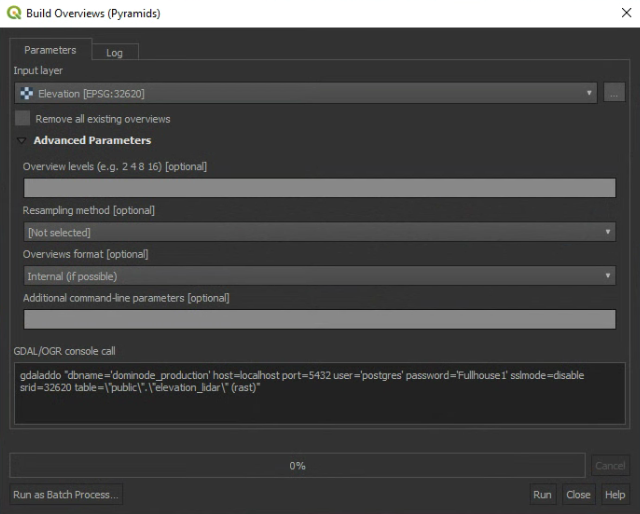
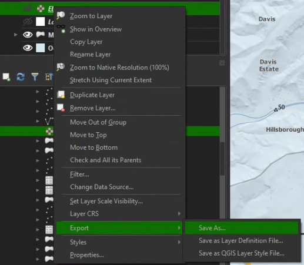
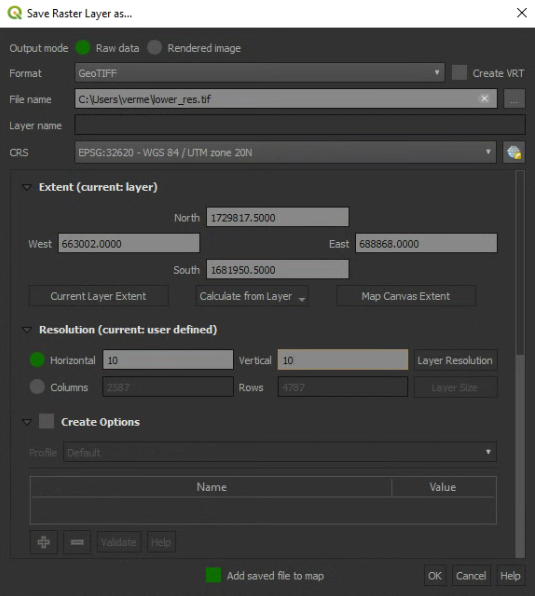
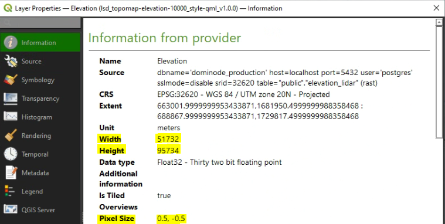
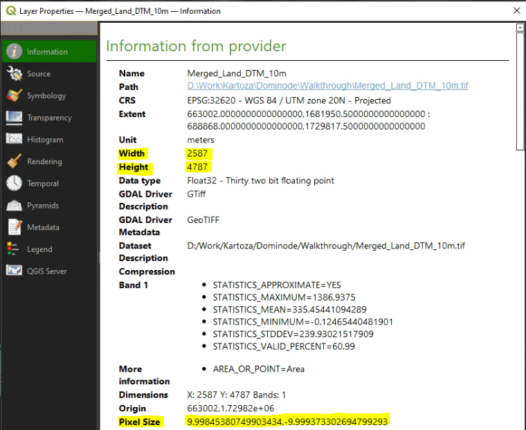

# Possible issues with QGIS

A user can encounter numerous issues while working with QGIS (or any other software). This section provides
a guide to a QGIS user on how to resolve some issues, or a workaround for the issues. These approaches
will not always solve your problem.

## QGIS crashes when opening a project

The likely cause of this that the project were saved in a different version of QGIS.
Do the following to resolve such cases:
- Install an LTR version of QGIS (e.g. 3.16), and use it to open the project
- Attempt to find out what version the project is stored in
- If the user knows the version, install that version

> It might be easier to do this in Windows, as it's much easier to install older version in Windows than Linux

- If you are opening a project in a Postgres DB, be sure the DB is stored in the correct postgres version
- Be sure that the project has access to the data it needs to load
- Check if the data is not corrupted (e.g. try loading the data in another project)

## Missing layers

The user might encounter a missing layer when opening a QGIS project. This usually happens if the layer
source name or directory has changed. A quick solution will be to just remove the layer and readd it,
but in some instances a user would like to keep the symbologies and other properties set for the layer.
A better solution is therefore required for such cases.

- Right-click on the faulty layer, and click on **Repair Data Source**
- The **Repair Data Source** dialog will open

- Browse and select the layer which should be used

- Click **OK**
- The layer will now be repaired.

## Loading rasters

Rasters can sometimes take forever to load, or cause QGIS to crash while a user waits for it to finish.
This can happen for several reasons, most likely that the raster has an extremely high spatial resolution and covers
a large area. A computer with poor performance will also have more problems. Here are two possible approaches at remeding the issue.

### Generate pyrymid layers

Pyrymid layers will drastically improve raster load times in spatial software. If a raster takes too long to load, the
best will be to generate pyrimid layers if it has none.

> Be aware that for large raster the pyrimid layers can take up a lot of space

- Open the QGIS Processing toolbox

- Type "pyramid" in the **Search**
- Open the **Build overviews (pyramids)** tool;
- Select the raster layer for which pyramids should be generated;
- **Advanced Parameters** can be changed as disired, but default should suffice for most cases;
- Click **Run**.

Depending on the raster size, this may run a while. Once done, loading the raster will be much faster in QGIS.

### Raster resolution

If pyramid layers did not solve the user's loading problems, reducing the spatial resolution can also help.

> Do not use this approach if you want to keep the accuracy/quality of the data, or if you need to perform analysis on the data.

- Right-click on the raster, go to **Export** and click on **Save As**

- Select the output **Format**
- Set the output **File name**
- The **CRS** is best to be set to that of the raster
- Change the extent as desired
- Change the **horizontal** and **vertical** values to the desired spatial resolution
- Click **OK**

Reducing the spatial resolution, especially if the higher resolution is not
required, will allow a user to spend less time waiting for the QGIS canvas to refresh, or
needing to restart QGIS because it crashed.

Here is an example of the number of pixels of a raster at a high spatial resolution:

Here is the same raster at a much lower spatial resolution:

