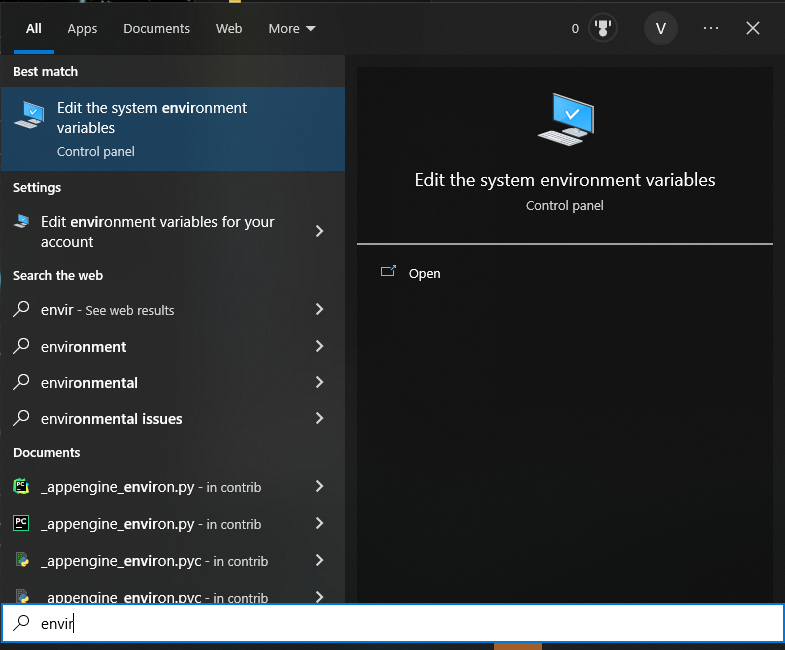
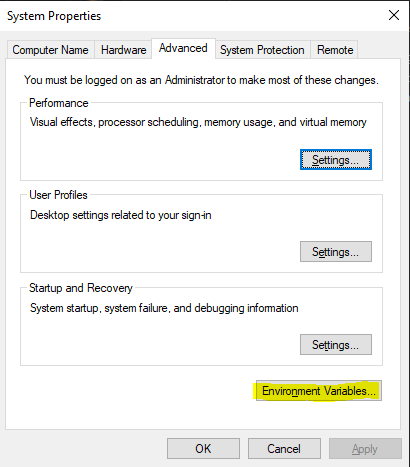
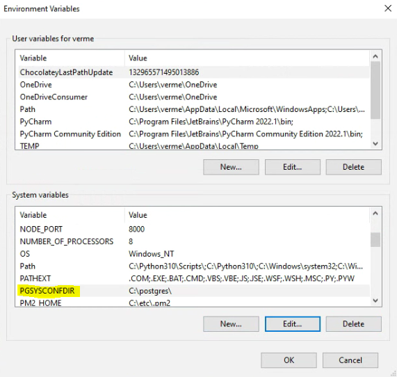

# Service file

A service file is essential to work for the DB the user needs to set up.
The service file can contain several DBs, and the credentials, host, DB name, etc. of each database.

These steps are only required if the service file does not exist on the server:
- Create a new file in a folder where your prefer to store it
- Name the file "pg_service.conf"

Add the DB which will be restored/created to the service file as follows:
- Open the service file in a text editor
- Add the following based on the requirements for the database which will be created/restored

- Save the file

If the user is making use of Windows, the user needs to create the environmental variable for the
service file location. These steps can be ignored on Linux.

- In the Windows search, type "environment"
- Select **Edit the system environmental variables**

- The **System Properties** dialog will open
- Click on **Environmental Variables** at the bottom

- The **Environmental Variables** dialog will open

- Under system variables, click **New**
- Provide the following information:
  - **Variable name**: PGSYSCONFDIR
  - **Variable value**: The directory which contains the service file

- Click **OK**
- The user can now close the **Environmental Variables** dialog